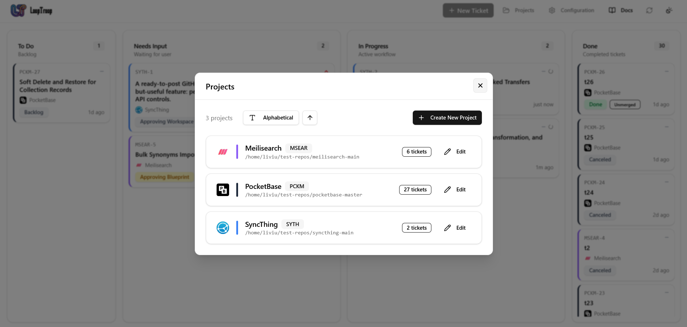
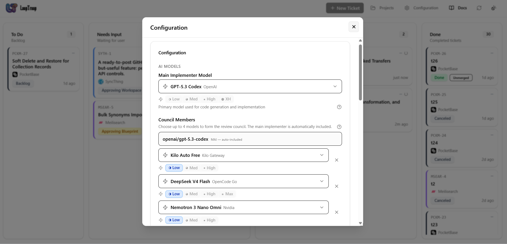
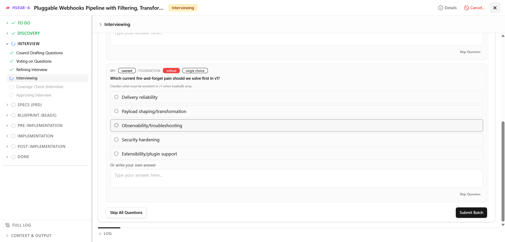
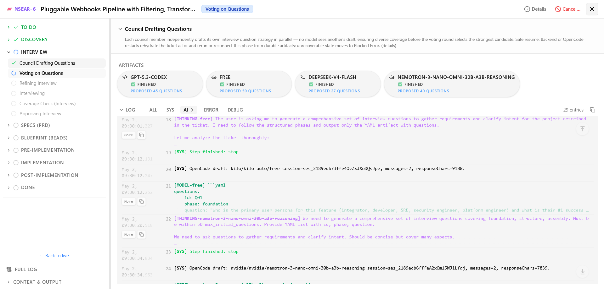
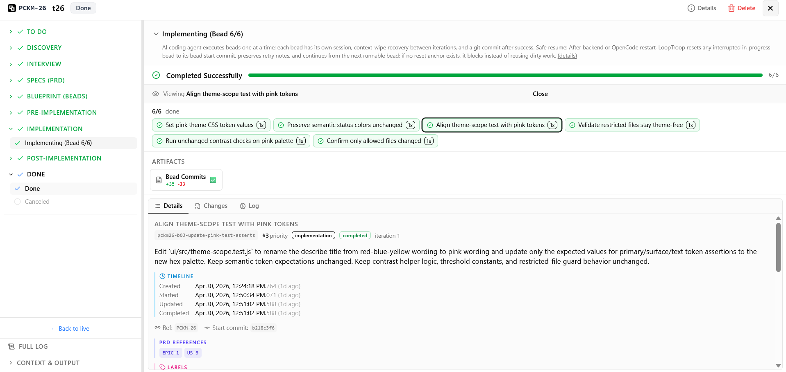

# LoopTroop

> **Local AI coding orchestration for repo-scale work.**
> LLM councils plan it. Ralph loops recover it. OpenCode worktrees ship it.

LoopTroop helps you turn a coding ticket into a planned, reviewable, agent-executed pull request.

Instead of running one long fragile coding-agent chat, LoopTroop separates the work into planning, approval, isolated execution, recovery, and final review.

**Start here:**
[Docs](https://www.looptroop.ovh/) |
[Getting Started](https://www.looptroop.ovh/getting-started) |
[Ticket Flow](https://www.looptroop.ovh/ticket-flow) |
[LLM Council](https://www.looptroop.ovh/llm-council) |
[Execution Loop](https://www.looptroop.ovh/execution-loop)

---

## What is LoopTroop?

LoopTroop is a local control plane for AI coding agents.

You give it a local git repository and a ticket. LoopTroop helps turn that ticket into:

1. a focused planning interview
2. a product-style spec
3. a bead-by-bead implementation plan
4. an isolated coding workspace
5. OpenCode execution
6. recovery attempts when the agent gets stuck
7. a pull request you review before finishing

The goal is not to make the AI invisible. The goal is to make AI coding work easier to inspect, restart, approve, and trust.

## Safety first: run it in a VM

LoopTroop is designed for serious agentic coding experiments.

The coding agent runs through OpenCode and may execute commands for a long time. Depending on your OpenCode and tooling setup, that can mean broad local privileges.

**Recommended setup: run LoopTroop inside a disposable VM, cloud dev machine, or sandboxed development environment.**

Why:

- git worktrees protect your attached repository checkout
- approval gates protect the workflow
- logs and artifacts help you inspect what happened
- a VM protects the rest of your computer

A good rule: only attach repositories and folders you are comfortable letting an AI coding agent modify.

## How it works

```text
Ticket
  -> file scan
  -> LLM Council planning
  -> human approval
  -> bead-by-bead OpenCode execution
  -> Ralph-style recovery when needed
  -> final test and PR review
```

LoopTroop keeps workflow state outside the model, stores durable artifacts, and asks for approval at important boundaries.

## Screenshots


<small>Manage attached repositories, review ticket counts, and create new projects from the dashboard.</small>


<small>Choose the main implementer model, council members, and effort levels for local orchestration.</small>


<small>Answer focused planning questions before specs and implementation plans are approved.</small>


<small>Track council progress, generated artifacts, and live execution logs inside a ticket.</small>


<small>Review bead completion, commits, changes, and final implementation details before closing the workflow.</small>

## Why not just use a coding agent directly?

Direct coding-agent loops are useful, but they often become hard to control when the work gets large.

| Common problem | What happens | LoopTroop's answer |
| --- | --- | --- |
| Weak planning | One model makes one plan and misses details | LLM Council planning |
| Context rot | A long chat loses important information | Phase-specific context |
| Bad retries | The agent keeps repairing inside a polluted session | Ralph-style fresh retries |
| Risky edits | Work happens in your normal checkout | Isolated git worktrees |
| Hidden state | You cannot see what really happened | SQLite state, JSONL logs, and `.ticket/**` artifacts |
| Silent automation | The agent keeps moving without you | Human approval gates |

## Core ideas

### LLM Council

The LLM Council is LoopTroop's planning system.

Instead of asking one model for one answer, LoopTroop can ask multiple models to draft independently, compare options, refine the best direction, and verify coverage before execution.

Used for:

- interview questions
- PRD/spec generation
- bead planning
- plan review

Read more: [LLM Council](https://www.looptroop.ovh/llm-council)

### Beads

A bead is a small implementation unit.

LoopTroop breaks bigger work into beads so the coding agent can focus on one concrete task at a time instead of trying to solve the entire feature in one giant pass.

A bead can include:

- purpose
- acceptance criteria
- dependencies
- target files
- expected validation

Read more: [Beads](https://www.looptroop.ovh/beads)

### Ralph-style recovery

When an agent attempt fails, continuing the same conversation can make things worse.

LoopTroop can preserve a compact note about what failed, reset the worktree to a known point, discard the polluted session, and retry with fresh context.

That is the Ralph-loop idea in LoopTroop:

```text
fail -> write down what failed -> reset -> retry fresh
```

Read more: [Execution Loop](https://www.looptroop.ovh/execution-loop)

### Worktree isolation

LoopTroop executes ticket work inside isolated git worktrees instead of directly editing your normal project checkout.

This helps keep:

- your main checkout cleaner
- ticket artifacts local to the ticket
- retry/reset behavior more reliable
- diffs easier to inspect before PR delivery

Worktrees are repository isolation, not machine isolation. For host-level safety, use a VM.

Read more: [System Architecture](https://www.looptroop.ovh/system-architecture)

### Human approval gates

LoopTroop is not a fully unattended "press button and pray" system.

You approve the important transitions, including planning artifacts, execution setup, and final PR outcome.

The model does the work. You keep control of when the workflow moves forward.

Read more: [Ticket Flow](https://www.looptroop.ovh/ticket-flow)

## Quick start

Use a VM or disposable development environment first.

```bash
git clone https://github.com/looptroop-ai/LoopTroop.git
cd LoopTroop
npm run dev
```

`npm run dev` starts the local LoopTroop stack and runs the startup preflight. The preflight can refresh the local OpenCode CLI, sync direct npm dependencies, and run safe audit remediation during local development.

The app starts:

| Service | Default address |
| --- | --- |
| Dashboard | `http://localhost:5173` |
| Backend API | `http://localhost:3000` |
| Docs | `http://localhost:5174` |
| OpenCode | `http://127.0.0.1:4096` |

Once the dashboard is open:

1. click **Add Project**
2. select a local git repository with a GitHub origin
3. create a ticket
4. review the plan
5. approve execution
6. inspect the final PR result

Full setup: [Getting Started](https://www.looptroop.ovh/getting-started)

## What you need

LoopTroop expects:

- Node.js and npm
- git
- a local repository with a GitHub origin
- OpenCode available locally
- model/provider configuration through OpenCode
- a VM or sandboxed dev environment for safer agent execution

## Who is this for?

LoopTroop is for developers experimenting with agentic coding workflows who want more control than a single coding chat.

It is especially useful if you care about:

- repo-scale AI coding
- multi-model planning
- LLM orchestration
- agent orchestration
- isolated execution
- fresh-context retries
- human-gated PR delivery
- auditable logs and artifacts

## What LoopTroop is not

LoopTroop is not a magic autopilot.

It does not remove the need to review code, inspect diffs, protect secrets, or run work in a safe environment.

It is best understood as an orchestration layer around coding agents: planning, state, approvals, execution boundaries, retries, and delivery.

## Documentation

The README gives the first-glance overview. The full docs live at:

https://www.looptroop.ovh/

Useful pages:

| Page | What it explains |
| --- | --- |
| [Getting Started](https://www.looptroop.ovh/getting-started) | Setup, ports, environment variables, first project attach |
| [Ticket Flow](https://www.looptroop.ovh/ticket-flow) | End-to-end workflow from ticket to PR result |
| [LLM Council](https://www.looptroop.ovh/llm-council) | Multi-model draft, vote, refine, and coverage planning |
| [Execution Loop](https://www.looptroop.ovh/execution-loop) | Bead execution, retries, resets, context wipe notes |
| [Beads](https://www.looptroop.ovh/beads) | The execution-unit model |
| [System Architecture](https://www.looptroop.ovh/system-architecture) | Runtime actors, storage, worktrees, artifacts |
| [OpenCode Integration](https://www.looptroop.ovh/opencode-integration) | Session ownership, reconnects, streaming, health checks |
| [FAQ](https://www.looptroop.ovh/faq) | Common questions and terminology |

When the app is running, the same docs are also available from the dashboard.

## Project status

LoopTroop is early alpha software.

The current focus is making local AI coding orchestration more durable, understandable, and recoverable.

Expect active changes around:

- planning quality
- execution reliability
- OpenCode integration
- retry behavior
- review surfaces
- workflow safety
- documentation

Roadmap: [Roadmap](https://www.looptroop.ovh/roadmap)

## Contributing

Contributions, ideas, bug reports, and workflow feedback are welcome.
