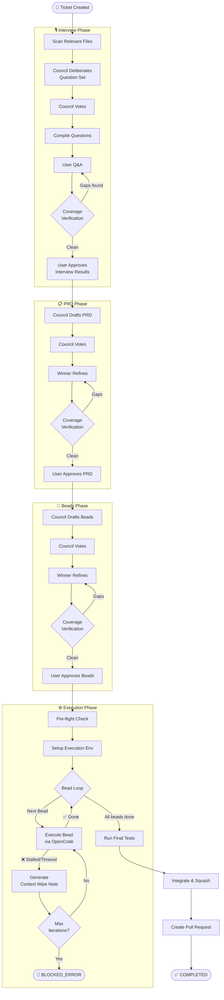

# LoopTroop

> **Slow, deliberate, and near-perfect.** A next-generation AI coding orchestrator that takes a feature idea and delivers a production-ready pull request — by solving the two fundamental flaws of current AI coding tools.

---

## What is LoopTroop?

LoopTroop is a **local GUI orchestrator** that links with your repository via [OpenCode](https://github.com/opencode-ai/opencode). It guides a feature from a rough idea all the way to a merged, tested Pull Request through a rigorous multi-phase AI pipeline — prioritising **correctness and completeness** over speed.

It is designed for **serious, production-grade feature development** — not trivial one-liners, not massive monolith clones. Think: "I need a robust authentication system with refresh tokens and role-based access control" rather than "change the button colour".

---

## Core Philosophy

LoopTroop exists to solve two fundamental flaws in current AI coding tools:

### 1. Context Rot & The "Lost in the Middle" Phenomenon

LLMs suffer severe performance degradation when their context windows fill past ~60%. Automatic context compaction causes catastrophic loss of vital details, and long-running chats accumulate irrelevant noise that poisons the model's focus.

**Our solution:** Aggressive session isolation. LoopTroop never reuses a chat session across phases or retries. Every single stage — every council draft, every bead iteration — gets a **fresh, minimal context** assembled from only the exact artifacts that phase needs. This is enforced by the `buildMinimalContext()` function with strict per-phase allowlists.

→ See [Context Isolation](docs/context-isolation.md)

### 2. The "Infinite Loop" Trap (Bounded Agentic Retry Loops)

Agentic models get stuck endlessly trying to fix the same bug in the same degrading context. Without a circuit-breaker, they spiral.

**Our solution:** A strict bounded retry loop. If a **Bead** (atomic unit of work) stalls or times out, LoopTroop:
1. Captures a **Context Wipe Note** (Post-Mortem) detailing what was tried and what failed.
2. Kills the session and resets the worktree to a clean git snapshot.
3. Spins up a fresh session with only the bead specification + the Post-Mortem Note.
4. Halts after a configurable maximum number of iterations (default: 5).

→ See [Execution Loop](docs/execution-loop.md) · [Beads](docs/beads.md)

---

## The Multi-Phase Pipeline

---

## Table of Contents

### Conceptual Guides
- [Core Philosophy](docs/core-philosophy.md) — Context Rot, Beads, LLM Council, Retry Loops
- [The LLM Council](docs/llm-council.md) — Draft → Vote → Refine pipeline, rubrics, quorum
- [Beads](docs/beads.md) — Atomic implementation units: data model, lifecycle, scheduler
- [Context Isolation](docs/context-isolation.md) — `buildMinimalContext()`, phase allowlists, token budget
- [Execution Loop](docs/execution-loop.md) — Bead executor, bounded retry, context-wipe notes

### Technical Reference
- [State Machine](docs/state-machine.md) — Complete XState map of all 30+ ticket statuses
- [Database Schema](docs/database-schema.md) — SQLite tables and relationships
- [API Reference](docs/api-reference.md) — REST endpoints and SSE event types
- [Frontend](docs/frontend.md) — React components, hooks, and contexts
- [OpenCode Integration](docs/opencode-integration.md) — Adapter, sessions, streaming

### Getting Started
- [Setup Guide](docs/setup-guide.md) — Prerequisites, installation, dev scripts

---

## Quick Facts

| | |
|---|---|
| **Interface** | Local web GUI (React + Tailwind) |
| **Backend** | Hono.js + SQLite (Drizzle ORM) |
| **Orchestration** | XState v5 state machine (30+ states) |
| **AI Provider** | OpenCode (external process, all providers) |
| **Execution model** | Unattended overnight runs (hours to days) |
| **Scope** | Mid-to-large production features |

---
