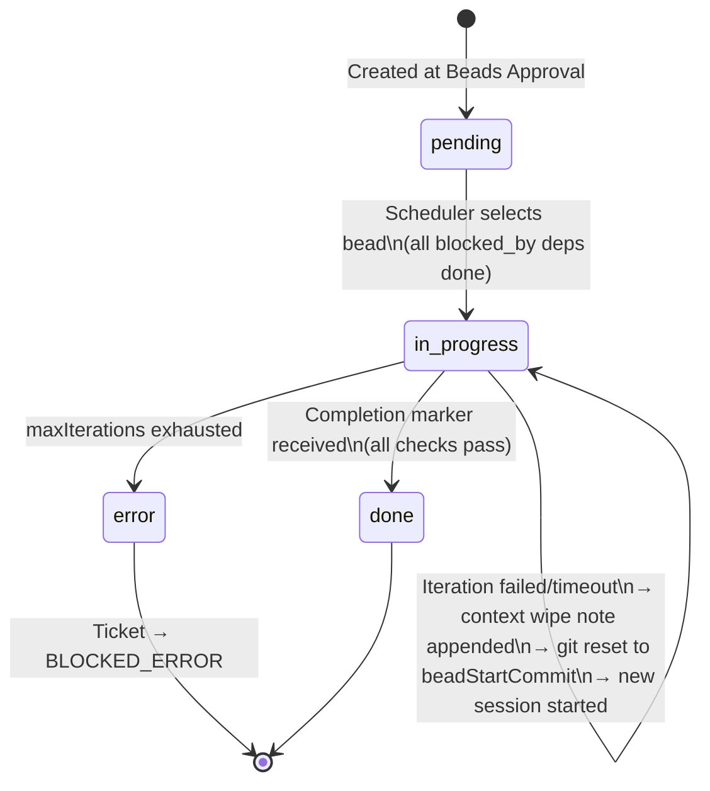

# Beads

A **Bead** is LoopTroop's fundamental unit of implementation — the atomic work item that OpenCode executes in isolation. This document explains what a bead is, its full data model, lifecycle, and how the scheduler and git machinery keep each execution clean.

---

## Table of Contents

1. [What is a Bead?](#what-is-a-bead)
2. [Bead Data Model (22 Fields)](#bead-data-model-22-fields)
3. [BeadSubset vs Expanded Fields](#beadsubset-vs-expanded-fields)
4. [Bead Lifecycle](#bead-lifecycle)
5. [The Bead File: issues.jsonl](#the-bead-file-issuesjsonl)
6. [Bead Scheduler](#bead-scheduler)
7. [Git Snapshot: beadStartCommit](#git-snapshot-beadstartcommit)
8. [Bead Diff & Artifact Review](#bead-diff--artifact-review)
9. [How Beads Solve Context Rot](#how-beads-solve-context-rot)

---

## What is a Bead?

A bead is a **small, independently completable unit of work** with explicit acceptance criteria, targeted tests, and a dependency graph. The concept comes from Steve Yegge's "beads" project methodology.

Design goals for beads:
- **Atomic** — completable in a single bounded OpenCode session.
- **Verifiable** — has its own tests and test commands, not the full suite.
- **Isolated** — context for bead execution contains *only* this bead's data.
- **Ordered** — topologically sorted by dependency graph; executed sequentially.

Beads are generated by the [LLM Council](llm-council.md) during the Beads phase and stored in `issues.jsonl`.

---

## Bead Data Model (22 Fields)

Defined in `server/phases/beads/types.ts`:

```typescript
interface Bead {
  // ── Core identity ──────────────────────────────────────────────────────
  id: string                  // Field 1  — Hierarchical kebab-case ID
                              //            (e.g. "epic-1--story-2--bead-3")
  title: string               // Field 2  — Short human-readable title
  priority: number            // Field 3  — Sequential execution order (lower = earlier)
  status: BeadStatus          // Field 4  — 'pending' | 'in_progress' | 'done' | 'error'
  issueType: string           // Field 5  — 'task' | 'bug' | 'chore' | etc.
  externalRef: string         // Field 6  — Parent ticket ID (e.g. "PROJ-12")
  prdRefs: string[]           // Field 7  — PRD epic/story references this bead implements
  labels: string[]            // Field 8  — Must map to at least one Epic and one Story

  // ── Implementation spec ────────────────────────────────────────────────
  description: string         // Field 9  — What to build and why
  contextGuidance: {          // Field 10 — Architectural direction
    patterns: string[]        //   Patterns to follow
    anti_patterns: string[]   //   Patterns to avoid
  }
  acceptanceCriteria: string[]// Field 11 — Verifiable completion conditions
  dependencies: {             // Field 12 — Dependency graph
    blocked_by: string[]      //   IDs of beads that must finish first
    blocks: string[]          //   IDs of beads this one unlocks
  }
  targetFiles: string[]       // Field 13 — Files expected to be created/modified
  tests: string[]             // Field 14 — Targeted test descriptions (not full suite)
  testCommands: string[]      // Field 15 — Exact commands to run (e.g. "npm test -- bead-3")
  notes: string               // Field 16 — Append-only context wipe notes from prior iterations

  // ── Runtime tracking ───────────────────────────────────────────────────
  iteration: number           // Field 17 — Current/last attempt number (starts at 1)
  createdAt: string           // Field 18 — ISO timestamp
  updatedAt: string           // Field 19 — ISO timestamp
  completedAt: string         // Field 20 — Filled when status = 'done'
  startedAt: string           // Field 21 — Filled when status = 'in_progress'
  beadStartCommit: string | null  // Field 22 — Git SHA for worktree reset on retry
}
```

---

## BeadSubset vs Expanded Fields

Beads are generated in two phases:

| Phase | Fields included | Prompt |
|-------|----------------|--------|
| **Draft** (council draft/vote/refine) | Fields 1, 2, 7, 9, 10, 11, 14, 15 | `PROM20` |
| **Expansion** (terminal expansion) | All 22 fields filled in | `PROM25` |

The `BeadSubset` type is used during council deliberation — the council only needs to reason about the semantic structure of the beads. The full `Bead` type (with priority, status, dependencies, target files, timestamps, etc.) is populated by the expansion phase before execution begins.

```typescript
type BeadSubset = Pick<Bead,
  'id' | 'title' | 'prdRefs' | 'description' |
  'contextGuidance' | 'acceptanceCriteria' | 'tests' | 'testCommands'
>
```

---

## Bead Lifecycle



### Status Transitions in Detail

| Transition | Trigger | Action |
|-----------|---------|--------|
| `pending` → `in_progress` | Scheduler selects bead | Records `startedAt`, records `beadStartCommit` (current HEAD), sets `iteration = 1` |
| `in_progress` → `in_progress` (retry) | Iteration timeout or completion marker failed | Appends to `notes`, increments `iteration`, resets git to `beadStartCommit`, kills session, creates new session |
| `in_progress` → `done` | Valid `<BEAD_STATUS>` marker with `status: done` and all checks pass | Records `completedAt`, commits bead changes via allowlisted `git add` |
| `in_progress` → `error` | `iteration` exceeds `maxIterations` | Emits `BEAD_ERROR` event to state machine → ticket `BLOCKED_ERROR` |

---

## The Bead File: issues.jsonl

All beads for a ticket are stored in a single JSONL file:

```
.looptroop/worktrees/<ticket-id>/.ticket/beads/main/.beads/issues.jsonl
```

This file is **append-only** and serves as the bead tracker. Each line is a JSON-serialized `Bead` object. The most recent entry for each bead ID is the canonical state.

### Why JSONL?

- **Append-only** — No in-place mutation risks; safe under concurrent writes.
- **Crash-safe** — Partial writes don't corrupt existing entries.
- **Human-readable** — Inspectable with standard tools (`jq`, `cat`).
- **Auditable** — Full history of every state change is preserved.

The file is committed to the ticket branch as part of the stable planning artifacts. Runtime churn files (`.ticket/runtime/**`, `.ticket/locks/**`) are gitignored.

---

## Bead Scheduler

**Module:** `server/phases/execution/scheduler.ts`

The scheduler determines which bead to execute next:

```typescript
// Returns all beads that can run right now
function getRunnable(beads: Bead[]): Bead[] {
  const doneIds = new Set(beads.filter(b => b.status === 'done').map(b => b.id))
  return beads
    .filter(b => b.status === 'pending')
    .filter(b => b.dependencies.blocked_by.every(dep => doneIds.has(dep)))
    .sort((a, b) => a.priority - b.priority)
}

// Returns the next bead to execute (highest priority runnable)
function getNextBead(beads: Bead[]): Bead | null {
  return getRunnable(beads)[0] ?? null
}

// True when all beads are in 'done' status
function isAllComplete(beads: Bead[]): boolean {
  return beads.length > 0 && beads.every(b => b.status === 'done')
}
```

**Scheduling rules:**
1. A bead is runnable only if all entries in its `dependencies.blocked_by` list are `done`.
2. Among runnable beads, lower `priority` value = runs first.
3. Only one bead executes at a time (sequential, not parallel) in the MVP.

---

## Git Snapshot: beadStartCommit

Before starting a bead's first iteration, LoopTroop records the current HEAD commit SHA as `beadStartCommit`.

**Why this matters:** If an iteration fails or times out, the worktree is reset to `beadStartCommit`:

```typescript
// server/phases/execution/gitOps.ts
async function resetToBeadStart(worktreePath: string, beadStartCommit: string) {
  // git reset --hard <beadStartCommit>
  // git clean -fd (removes untracked files)
}
```

This ensures each retry attempt begins from **exactly the same clean codebase state** as the first attempt, preventing partial changes from accumulating across failed iterations.

When a bead is successfully completed, its code changes are committed to the ticket branch using an **allowlisted `git add`** — only files with known-safe extensions are staged. LoopTroop explicitly blocks commits of:
- `.ticket/runtime/**` (execution-time churn)
- `.ticket/locks/**`
- `.ticket/streams/**`
- `.ticket/sessions/**`
- `.ticket/tmp/**`
- `node_modules/**`
- `.looptroop/**` (orchestrator metadata)

---

## Bead Diff & Artifact Review

After each bead completes, LoopTroop captures the git diff between `beadStartCommit` and the new HEAD. This diff is stored as a phase artifact and displayed in the **Bead Diff Viewer** in the UI — a CodeMirror-based side-by-side diff viewer available under `src/components/workspace/BeadDiffViewer.tsx`.

Users can browse any completed bead's diff in read-only mode by clicking it in the Bead Navigator Tree.

---

## How Beads Solve Context Rot

Each bead execution session receives exactly:

```
coding phase allowlist: ['bead_data', 'bead_notes', 'execution_setup_profile']
```

That's it. No PRD. No interview results. No other beads. No conversation history.

`bead_data` is the single bead's JSON specification. `bead_notes` are the accumulated Context Wipe Notes from any prior failed iterations. `execution_setup_profile` provides environment details (how to run tests, install deps, etc.).

This **minimal, sharply-focused context** keeps the AI's attention on exactly one task and prevents the degradation that occurs in long-running, context-heavy sessions.

→ See [Context Isolation](context-isolation.md) for the full allowlist system
→ See [Execution Loop](execution-loop.md) for how context wipe notes are generated
