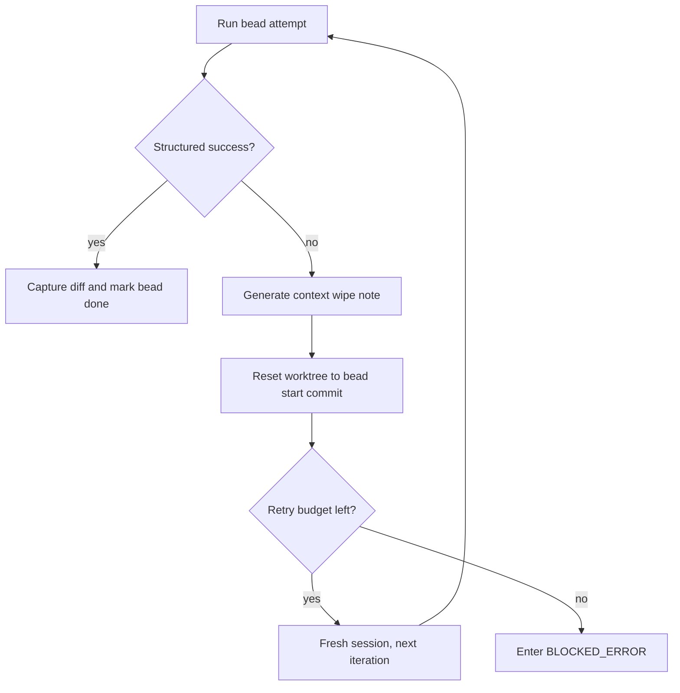

# Execution Loop

LoopTroop executes approved work through a bounded bead loop, not through one giant autonomous coding session.

The core implementation lives in `server/phases/execution/executor.ts`.

The workflow-side orchestration that resumes interrupted coding work lives in `server/workflow/phases/executionPhase.ts` and `server/workflow/phases/beadsPhase.ts`.

## Execution Phases Around The Loop

| UI group | Phase | Purpose |
| --- | --- | --- |
| Pre-Implementation | `PRE_FLIGHT_CHECK` | Confirm the ticket is ready to leave planning |
| Pre-Implementation | `WAITING_EXECUTION_SETUP_APPROVAL` | Human review of the setup plan |
| Pre-Implementation | `PREPARING_EXECUTION_ENV` | Materialize the execution environment |
| Implementation | `CODING` | Run beads one at a time with bounded retries |
| Post-Implementation | `RUNNING_FINAL_TEST` | Validate the full result after all beads are done |
| Post-Implementation | `INTEGRATING_CHANGES` | Prepare the final change set |
| Post-Implementation | `CREATING_PULL_REQUEST` | Publish the delivery artifact |
| Post-Implementation | `WAITING_PR_REVIEW` | Wait for merge or close-unmerged outcome |
| Post-Implementation | `CLEANING_ENV` | Remove temporary execution state |

## The Bead Execution Cycle

`executeBead()` is the heart of the loop.

For each bead:

1. Load the active bead specification and the current execution profile.
2. Recover any interrupted in-progress bead from its recorded start snapshot.
3. Start or reattach to the owned OpenCode session for that bead iteration.
4. Prompt the model with the coding template and the narrow execution context.
5. Require structured completion markers so the system can tell whether the attempt really finished.
6. Capture logs, diff artifacts, and status updates.
7. Mark the bead done, or generate a retry path if the attempt failed.

## Structured Completion Matters

Execution does not trust plain "I think I'm done" prose.

The executor uses two structured reminders:

- `BEAD_STATUS_SCHEMA_REMINDER`
- `CONTINUE_CODING_SCHEMA_REMINDER`

These reminders force the model to emit machine-checkable progress state. If the marker is missing or malformed, LoopTroop can retry with a specific corrective prompt instead of guessing what happened.

## Bounded Ralph-Style Retry

> [!NOTE]
> **The Ralph Loop Philosophy:** Instead of trying to talk an AI out of a broken coding spiral, LoopTroop acts like a strict manager. It says "stop, write down what failed, throw away your scratchpad, and start over with a clear head."

When a bead attempt fails, LoopTroop does not keep extending the same degraded transcript.

This is the execution discipline that most closely matches the Ralph-loop idea: preserve the useful post-mortem, discard the polluted conversational state.

## Context Wipe Notes

`generateContextWipeNote()` uses `PROM51` to summarize the failed attempt in the same session before abandonment.

The note is intentionally compact. It exists to answer:

- what the bead was trying to do
- what failed
- what was already tried
- what the next fresh attempt should keep in mind

If the model cannot generate a good note, LoopTroop can still fall back to a simpler synthesized failure note.

## Session Strategy

Execution combines fresh sessions with ownership-aware reconnect.

| Behavior | Why it exists |
| --- | --- |
| Fresh session per retry | Avoid carrying corrupted reasoning into the next iteration |
| Ownership-aware reconnect | Survive restart or resumable phase transitions when the same owned session still exists |
| Explicit completion or abandonment | Keep session state auditable in `opencode_sessions` |

See [OpenCode Integration](opencode-integration.md) for the full session model.

## Worktree Hygiene

Execution happens inside the ticket worktree, not the attached project root.

Important `gitOps.ts` behavior:

- diffs are captured without `.ticket/**`
- bead commit creation is best-effort
- resets can hard-reset and clean the worktree back to the bead start snapshot
- runtime directories like `.ticket/runtime`, `.ticket/locks`, `.ticket/streams`, `.ticket/sessions`, `.ticket/tmp`, `node_modules`, `.looptroop`, `dist`, and `build` are blocked from normal change capture

This is what makes retries safe: the next attempt starts from a known repository state.

On startup or manual retry, `CODING` recovery uses the same reset path. A bead left `in_progress` by a backend crash is reset to `beadStartCommit` and written back as `pending` before the scheduler selects work. If the bead has no recorded start commit, LoopTroop blocks instead of continuing in a worktree it cannot prove clean.

## Scheduler Interaction

Execution does not pick arbitrary work. It asks the scheduler for the next runnable bead.

The scheduler currently exposes:

- `getRunnable(beads)`
- `getNextBead(beads)`
- `isAllComplete(beads)`

That means dependencies are enforced outside the model. The model implements the active bead; the scheduler decides which bead is eligible.

## Success Path

A successful bead execution typically does all of the following:

- updates bead status
- persists logs
- captures a bead diff artifact
- advances runtime progress
- hands control back to the scheduler

Once all beads are complete, the workflow moves to final testing and then PR delivery.

## Failure Path

LoopTroop distinguishes between recoverable iteration failure and terminal blockage.

| Outcome | Meaning |
| --- | --- |
| Retry current bead | The system believes a fresh attempt may still succeed |
| `BLOCKED_ERROR` | The retry budget is exhausted or recovery is no longer trustworthy |
| Ticket cancel | User aborts the run and active sessions are abandoned |

Error occurrences are persisted so the UI can show both the live failure and past failures for the ticket.

Execution recovery is intentionally stricter after process or OpenCode interruptions:

- an interrupted bead is not treated as successful just because the model session might have continued somewhere else
- model sessions are owned by ticket, phase, phase attempt, bead, and iteration before they are reused
- the worktree must reset to the bead-start commit before a failed or interrupted coding retry can run
- missing reset metadata keeps the ticket blocked so the user can inspect the partial state manually

## Execution Configuration Controls

> [!TIP]
> For the full reference including defaults, ranges, and practical guidance, see the [Configuration Reference](/configuration).

### Execution Setup Timeout

Execution setup timeout is the maximum allowed runtime for the one-time `PREPARING_EXECUTION_ENV` step after the setup plan is approved. It bounds setup work such as installing toolchains, warming caches, and preparing repository-local runtime artifacts.

### Per-Iteration Timeout

Per-iteration timeout is the maximum allowed runtime for one bead attempt in `CODING`. If an attempt exceeds this budget, LoopTroop treats it as a failed iteration and routes it through the normal retry path.

### Max Bead Retries

Max bead retries defines how many fresh-session re-attempts LoopTroop allows for a bead before it enters `BLOCKED_ERROR`. The same limit also bounds final-test retries so execution remains deterministic.

### Tool Log Truncation

The system restricts the maximum character length for tool inputs, outputs, and errors within logs to prevent infinite runaway logs. `Tool Input Max Chars`, `Tool Output Max Chars` and `Tool Error Max Chars` configure these hard caps.

## Why This Loop Exists

The execution loop exists because coding models are good at focused work but unreliable at long self-healing conversations. LoopTroop narrows the task, constrains the runtime state, and bounds retries so the system can recover without pretending the model has infinite patience or perfect memory.

## Related Docs

- [Beads](beads.md)
- [Context Isolation](context-isolation.md)
- [OpenCode Integration](opencode-integration.md)
- [System Architecture](system-architecture.md)
