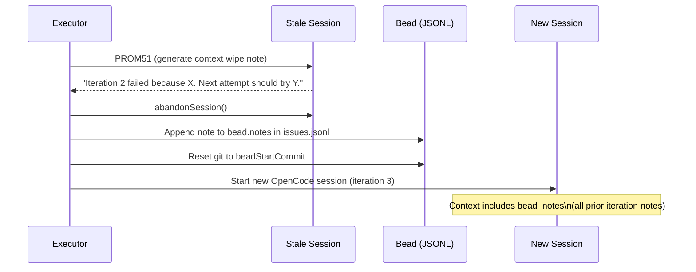
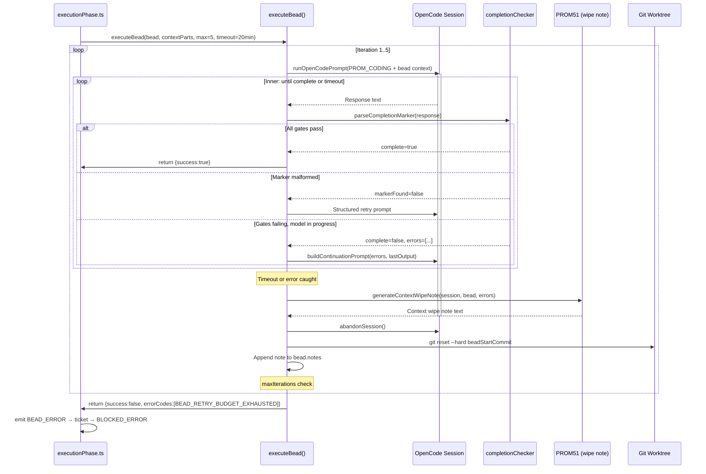

# Execution Loop

The execution loop is the heart of LoopTroop's "Bounded Agentic Retry" system. It controls how a single [Bead](beads.md) is given to OpenCode, how failures are handled, and how a stalled session is terminated gracefully with a **Context Wipe Note** before a fresh session begins.

---

## Table of Contents

1. [Overview](#overview)
2. [Loop Architecture](#loop-architecture)
3. [Phase 1: Initial Coding Session (PROM_CODING)](#phase-1-initial-coding-session-prom_coding)
4. [Phase 2: Continuation Prompt](#phase-2-continuation-prompt)
5. [Phase 3: Structured Retry](#phase-3-structured-retry)
6. [The Completion Marker (\<BEAD_STATUS\>)](#the-completion-marker-bead_status)
7. [Iteration Timeout & Budget Exhaustion](#iteration-timeout--budget-exhaustion)
8. [Context Wipe Note (PROM51)](#context-wipe-note-prom51)
9. [Git Reset Between Iterations](#git-reset-between-iterations)
10. [Full Sequence Diagram](#full-sequence-diagram)

---

## Overview

**Module:** `server/phases/execution/executor.ts`  
**Entry point:** `executeBead(adapter, bead, contextParts, projectPath, maxIterations, timeout)`

Each call to `executeBead()` runs one bead through a bounded retry loop:

- **Up to `maxIterations` iterations** (default: 5)
- **Each iteration has a per-iteration timeout** (default: 20 minutes)
- If an iteration fails, a Context Wipe Note is generated, the stale session is abandoned, and a fresh session starts from a clean git snapshot
- If the budget is exhausted, `BEAD_RETRY_BUDGET_EXHAUSTED` error code is returned

---

## Loop Architecture

```
executeBead()
│
├── Iteration 1
│   ├── runOpenCodePrompt()          ← fresh session, full bead context (PROM_CODING)
│   ├── [inner loop] check <BEAD_STATUS>
│   │   ├── Complete → return success
│   │   ├── Marker malformed → structured retry (same or fresh session)
│   │   └── Incomplete → continuation prompt (same session)
│   │
│   └── Timeout / Error
│       ├── generateContextWipeNote()    ← PROM51 — in same dying session
│       ├── abandonSession(stale)
│       ├── onContextWipe() callback     ← appends note to bead.notes
│       └── reset git to beadStartCommit
│
├── Iteration 2
│   └── (same as above, fresh session)
│
└── Iteration N (maxIterations)
    └── Return ExecutionResult{success:false, errorCodes:[BEAD_RETRY_BUDGET_EXHAUSTED]}
```

---

## Phase 1: Initial Coding Session (PROM_CODING)

Each iteration begins with `runOpenCodePrompt()`, which creates a **brand new OpenCode session**.

The prompt is assembled using `buildPromptFromTemplate(PROM_CODING, contextParts)`:

```typescript
const promptContent = buildPromptFromTemplate(PROM_CODING, await resolveContextParts(contextParts))
```

The `contextParts` for the coding phase always come from `buildMinimalContext('coding', ticketState)`, which provides exactly three sources:

| Context Source | Content |
|---------------|---------|
| `bead_data` | Complete JSON of the active bead (all 22 fields) |
| `bead_notes` | Accumulated Context Wipe Notes from prior iterations |
| `execution_setup_profile` | Environment profile (install cmds, test runner, etc.) |

The session is registered in the `opencodeSessions` table with:
- `phase: 'CODING'`
- `beadId: bead.id`
- `iteration: <current>`
- `state: 'active'`
- `keepActive: true` (the session should survive a single prompt completion — execution continues via continuation prompts)

---

## Phase 2: Continuation Prompt

After each prompt response, the completion marker is parsed. If the bead is **incomplete but the model appears to be making progress** (marker found but gates not passing), a continuation prompt is sent to the **same session**:

```
## Continue Bead Execution

Bead: <bead-id>

The current bead attempt is still in progress. Do not stop yet.
Inspect the real failures, keep editing code in this same session,
rerun the failing checks, and continue until the bead is actually
complete or the app interrupts you.

Current blocker summary: <error summary>

<CONTINUE_CODING_SCHEMA_REMINDER>

Previous response:
```<last model output>```
```

Key instructions in the continuation prompt:
- Do **not** stop because lint/tests/typecheck failed — fix them and rerun.
- Do **not** reply with a progress update or plan — keep using tools.
- Do **not** return `status: error` while iteration time remains.
- Only return the final `<BEAD_STATUS>` marker when **all checks pass**.

---

## Phase 3: Structured Retry

If the completion marker is **completely missing or malformed** (not just failing gates), a structured retry is attempted. This uses the [`getStructuredRetryDecision()`](../server/lib/structuredOutputRetry.ts) heuristic:

```typescript
if (shouldUseStructuredRetry(result)) {
  const retryDecision = getStructuredRetryDecision(lastOutput, runResult.responseMeta)
  
  if (retryDecision.reuseSession) {
    // Same session — ask the model to output the schema-compliant marker
    runResult = await runOpenCodeSessionPrompt({ ... retryParts ... })
    continue
  }
  
  // Different session — abandon and restart
  await sessionManager.abandonSession(activeSessionId)
  runResult = await runBeadPrompt()  // fresh session, same context
  continue
}
```

The structured retry sends a concise message reminding the model of exactly what schema is required:

```
Return exactly one <BEAD_STATUS>...</BEAD_STATUS> block and nothing else.
Inside the marker, return a single JSON or YAML object with: bead_id, status, checks.
checks must contain exactly: tests, lint, typecheck, qualitative.
```

---

## The Completion Marker: \<BEAD_STATUS\>

**Module:** `server/phases/execution/completionChecker.ts`

The model signals bead completion by outputting a structured XML marker:

```xml
<BEAD_STATUS>
{
  "bead_id": "epic-1--story-2--bead-3",
  "status": "done",
  "checks": {
    "tests": "pass",
    "lint": "pass",
    "typecheck": "pass",
    "qualitative": "pass"
  }
}
</BEAD_STATUS>
```

`parseCompletionMarker()` parses this and returns:

```typescript
interface CompletionMarkerResult {
  complete: boolean      // true if marker found and all 4 checks = 'pass'
  markerFound: boolean   // true if XML tags were found at all
  gatesValid: boolean    // true if all checks pass
  errors: string[]       // human-readable list of failures
  validationError?: string  // schema validation message if any
}
```

### Gate Checks

| Gate | Field | Meaning |
|------|-------|---------|
| `tests` | `checks.tests` | Bead-targeted test suite passes |
| `lint` | `checks.lint` | Lint check passes |
| `typecheck` | `checks.typecheck` | TypeScript type check passes |
| `qualitative` | `checks.qualitative` | Model's own judgment — acceptance criteria met |

A bead is considered **successfully complete** only when all 4 gates are `"pass"` and `status` is `"done"`.

---

## Iteration Timeout & Budget Exhaustion

Each iteration has a deadline:

```typescript
const deadlineAt = Date.now() + timeout   // timeout = 1,200,000 ms (20 min)
```

The remaining time is checked at every continuation loop:

```typescript
const remainingMs = getRemainingTimeoutMs(deadlineAt)
if (remainingMs <= 0) {
  throw new Error('Timeout')
}
```

When `maxIterations` is reached without success:

```typescript
return {
  beadId: bead.id,
  success: false,
  iteration: lastAttemptIteration,
  output: lastOutput,
  errors,
  errorCodes: [BEAD_RETRY_BUDGET_EXHAUSTED],
}
```

The `BEAD_RETRY_BUDGET_EXHAUSTED` error code propagates back to the execution phase orchestrator (`executionPhase.ts`), which emits `BEAD_ERROR` to the state machine, transitioning the ticket to `BLOCKED_ERROR`.

---

## Context Wipe Note (PROM51)

When an iteration fails — whether from timeout, error, or budget exhaustion — LoopTroop generates a **Context Wipe Note** before abandoning the stale session.

This is the "Post-Mortem Note" concept: before the dying session loses all context, it documents:
- What was attempted
- What failed
- What error evidence was observed
- Hypotheses for the next attempt

### How it's generated

```typescript
// Still in the same (dying) session context
const note = await generateContextWipeNote(
  adapter,
  contextWipeSession,   // the active, stale session
  bead,
  formattedIterationErrors,
  lastOutput,
  recentFailureExcerpts,
  signal,
  { model, variant, iteration, ... }
)
```

The `generateContextWipeNote()` function uses prompt `PROM51`, passing:
- `bead_data` — the current bead spec
- `error_context` — compiled errors + recent failing tool call excerpts + last output

The `extractRecentFailureExcerpts()` function scans the session's message history backwards to find tool calls with `status: 'error'` or output matching `/fail|error|exception|not ok|timed out/i`.

### Fallback note

If the PROM51 call itself fails, a deterministic fallback note is generated without AI:

```
Attempt {N} failed or stalled before completion.
Errors: {errors}
Recent failures: {tool excerpts}
Last model output: {truncated}
Next attempt: start from the clean bead snapshot, rerun the failing checks...
```

### Note stamping and accumulation

The note is stamped with iteration number and timestamp:

```
[Iteration 2 — 2025-01-15T14:23:00.000Z]
<context wipe note content>
```

Notes are appended to `bead.notes` (separated by `---`) and persisted to `issues.jsonl`. The next iteration's context will include all accumulated notes via the `bead_notes` context source.



---

## Git Reset Between Iterations

Before starting a new iteration, the worktree is reset to `beadStartCommit`:

```typescript
// server/phases/execution/gitOps.ts
await resetToBeadStart(worktreePath, bead.beadStartCommit)
// → git reset --hard <sha>
// → git clean -fd
```

This guarantees each retry starts from **exactly the same codebase state** as the first attempt, regardless of what partial changes the previous iteration may have made.

---

## Full Sequence Diagram



---

→ See [Beads](beads.md) for the bead data model and scheduler  
→ See [Context Isolation](context-isolation.md) for how `bead_notes` are included in the next session  
→ See [State Machine](state-machine.md) for how `BLOCKED_ERROR` propagates and the `RETRY` mechanism
