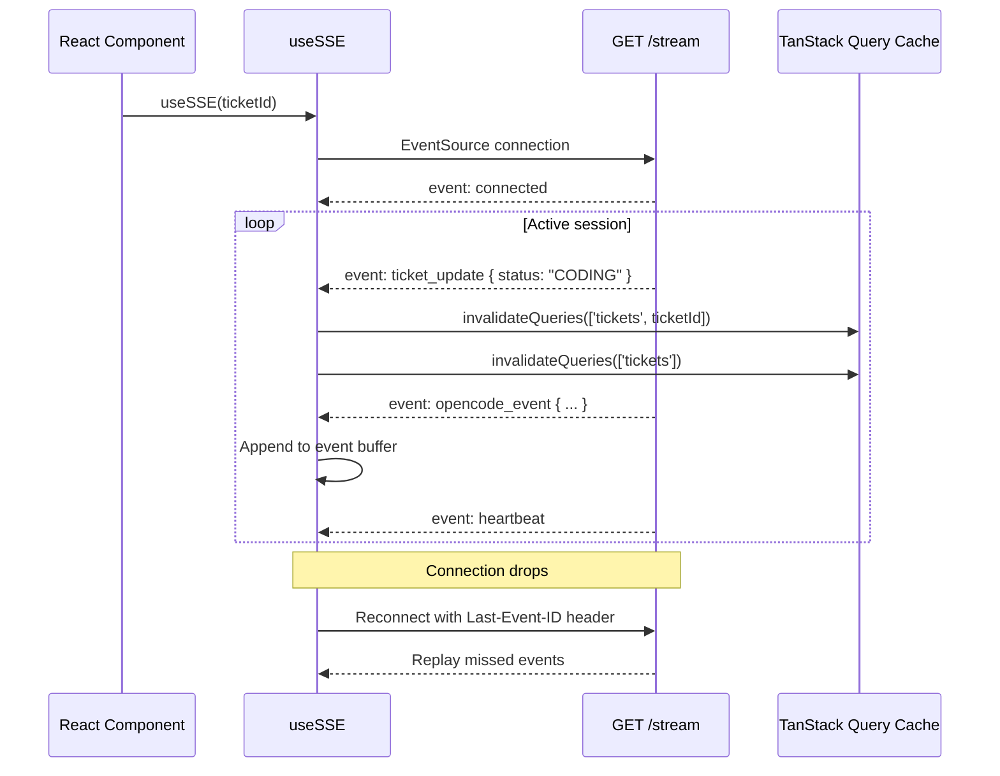

# Frontend

LoopTroop's frontend is a **React 19 + TypeScript** single-page application built with Vite. It communicates with the backend via REST (TanStack Query) and SSE for real-time ticket updates.

---

## Table of Contents

1. [Technology Stack](#technology-stack)
2. [Application Entry Point](#application-entry-point)
3. [Layout & Navigation](#layout--navigation)
4. [The Workspace: Per-Status Views](#the-workspace-per-status-views)
5. [Key Hooks](#key-hooks)
6. [React Contexts](#react-contexts)
7. [SSE Consumer (useSSE)](#sse-consumer-usesse)
8. [Artifact Viewers](#artifact-viewers)
9. [CodeMirror Integration](#codemirror-integration)
10. [Component Directory Map](#component-directory-map)

---

## Technology Stack

| Layer | Technology |
|-------|-----------|
| Framework | React 19 |
| Build tool | Vite 7 |
| Styling | Tailwind CSS v4 |
| Data fetching | TanStack Query v5 |
| UI primitives | Radix UI (Dialog, Dropdown, HoverCard, ScrollArea, Tooltip) |
| Icons | lucide-react |
| Code / diff editing | CodeMirror 6 |
| Real-time updates | Server-Sent Events (SSE) |
| Routing | No router — single-page layout (Kanban board drives navigation) |

---

## Application Entry Point

```
src/main.tsx           ← Mounts React app
src/App.tsx            ← TanStack QueryClientProvider + top-level layout
```

The app renders a **Kanban-style board** as the primary interface. There is no URL-based routing. The selected ticket and active view are driven by local UI state managed via `UIContext`.

---

## Layout & Navigation

```
src/components/layout/        ← App shell, sidebar, top bar
src/components/kanban/        ← Kanban board: column-per-phase layout
src/components/navigator/     ← Bead navigator tree sidebar
src/components/project/       ← Project selector / switcher
```

The Kanban board consumes `WORKFLOW_GROUPS` and `WORKFLOW_PHASES` from `/api/workflow/meta` (via `useWorkflowMeta`) to render the column structure. Each ticket card shows its current status, which maps to a Kanban column.

Clicking a ticket card opens the **Workspace** — a panel showing the appropriate view for the ticket's current status.

---

## The Workspace: Per-Status Views

The Workspace renders a different view component depending on the ticket's current `status`. All views live in `src/components/workspace/`.

| Status Group | View Component | Description |
|-------------|----------------|-------------|
| `DRAFT` | `DraftView.tsx` | Title/description editor + Start button |
| `SCANNING_RELEVANT_FILES`, `COUNCIL_DELIBERATING` | `CouncilView.tsx` | Live streaming output of council debate |
| `COUNCIL_VOTING_*`, `COMPILING_*`, `VERIFYING_*`, `DRAFTING_*` | `CouncilView.tsx` | Still showing council deliberation |
| `WAITING_INTERVIEW_ANSWERS` | `InterviewQAView.tsx` | Q&A interface — question list with answer inputs |
| `WAITING_INTERVIEW_APPROVAL` | `ApprovalView.tsx` + `InterviewApprovalPane.tsx` | Approve/edit interview document |
| `WAITING_PRD_APPROVAL` | `ApprovalView.tsx` + `PrdApprovalPane.tsx` | Approve/edit PRD document |
| `WAITING_BEADS_APPROVAL` | `ApprovalView.tsx` + `BeadsApprovalEditor.tsx` | Approve/edit beads list |
| `PRE_FLIGHT_CHECK`, `WAITING_EXECUTION_SETUP_APPROVAL` | `ApprovalView.tsx` + `ExecutionSetupPlanApprovalPane.tsx` | Review AI-generated setup plan |
| `PREPARING_EXECUTION_ENV` | `CouncilView.tsx` | Streaming execution setup progress |
| `CODING` | `CodingView.tsx` | Live execution with bead progress + log panel |
| `RUNNING_FINAL_TEST`, `INTEGRATING_CHANGES`, `CREATING_PULL_REQUEST` | `CodingView.tsx` | Final phase progress |
| `WAITING_PR_REVIEW` | `PhaseReviewView.tsx` | PR review with diff viewer and merge/close buttons |
| `CLEANING_ENV` | `CodingView.tsx` | Cleanup progress |
| `COMPLETED` | `DoneView.tsx` | Completion summary |
| `CANCELED` | `CanceledView.tsx` | Cancellation summary |
| `BLOCKED_ERROR` | `ErrorView.tsx` | Error display with Retry button |

---

## Key Hooks

**Module:** `src/hooks/`

### `useTickets`

```typescript
function useTickets(projectId?: number): UseQueryResult<Ticket[]>
```

Fetches and caches the full ticket list for a project. Used by the Kanban board to populate columns. Invalidated whenever an SSE `ticket_update` event arrives.

### `useSSE` (real-time core)

```typescript
function useSSE(ticketId: string): {
  events: SSEEvent[]
  connected: boolean
  lastEventId: string | null
}
```

Subscribes to `GET /stream?ticketId=<id>` and maintains an event buffer. Automatically reconnects with the `Last-Event-ID` header to avoid missed events. On reconnect, the server replays all buffered events since the last known ID.

All other hooks and components that need real-time data listen to `useSSE` events.

### `useTicketPhaseAttempts`

```typescript
function useTicketPhaseAttempts(ticketId: string, phase: string): UseQueryResult<PhaseAttempt[]>
```

Returns all phase attempt records for a phase. Used by `PhaseAttemptSelector` to allow browsing artifact history across retries.

### `useTicketArtifacts`

```typescript
function useTicketArtifacts(ticketId: string): UseQueryResult<PhaseArtifact[]>
```

Fetches all artifacts for a ticket. Used by `PhaseArtifactsPanel` to display the artifact browser.

### `useWorkflowMeta`

```typescript
function useWorkflowMeta(): UseQueryResult<WorkflowMeta>
```

Fetches `GET /workflow/meta` once and caches it for the session lifetime. Provides `WORKFLOW_GROUPS` and `WORKFLOW_PHASES` to the Kanban board.

### `useProfile`

```typescript
function useProfile(): UseQueryResult<Profile>
```

Fetches the active profile (AI model configuration). Used by the Start dialog to populate model selectors.

### `useOpenCodeModels`

```typescript
function useOpenCodeModels(): UseQueryResult<Model[]>
```

Fetches available AI models from `GET /models`. Powers the model selector dropdowns in the ticket Start dialog.

### `useBatchSubmit`

Manages the batching of interview answers. Accumulates answers until 3 are ready (or the user explicitly submits), then sends them via `POST /tickets/:id/answer-batch`.

---

## React Contexts

All contexts are defined in `src/context/` and provided at the app root level.

### `UIContext` (`UIContext.tsx`)

Manages global UI state:
- Active ticket selection
- Active workspace tab / drawer state
- Log drawer sizing
- Mobile sidebar visibility

Consumed via `useUI()` hook from `useUI.ts`.

### `LogContext` (`LogContext.tsx`)

Manages the execution log display:
- Stores raw log lines per ticket (keyed by `ticketId`)
- Controls log filtering (filter by log type, phase, session)
- Manages whether the full log view is open

Consumed via `useLogContext()` hook from `useLogContext.ts`.

### `AIQuestionContext` (`AIQuestionContext.tsx`)

Manages pending OpenCode clarification questions:
- Polls `GET /tickets/:id/opencode/questions` when a ticket is in an active state
- Provides callbacks for `reply` and `reject`
- Shows a question banner in the UI when questions are pending

Consumed via `useAIQuestions()` hook from `useAIQuestions.ts`.

---

## SSE Consumer (useSSE)

The `useSSE` hook is the backbone of real-time updates. Here's how it flows:



The broadcaster on the server side maintains a per-ticket event ring buffer. Events are retained long enough for typical reconnects (a few minutes of inactivity).

---

## Artifact Viewers

The `PhaseArtifactsPanel` and individual viewers render artifacts from `phase_artifacts`:

| Viewer Component | Renders |
|-----------------|---------|
| `ArtifactContentViewer.tsx` | Generic raw content viewer (YAML, JSON) |
| `BeadDiffViewer.tsx` | CodeMirror-based side-by-side diff viewer for bead diffs |
| `InterviewDocumentView.tsx` | Formatted interview Q&A document |
| `PrdDocumentView.tsx` | Structured PRD with epics/stories |
| `VerificationSummaryPanel.tsx` | Coverage check results |
| `CollapsiblePhaseLogSection.tsx` | Collapsible log section per phase |

The `phaseArtifactTypes.ts` utility maps `artifact_type` strings to viewer components and display labels.

---

## CodeMirror Integration

LoopTroop uses CodeMirror 6 for two purposes:

### 1. Bead Diff Viewer (`BeadDiffViewer.tsx`)

Displays the git diff for a completed bead using CodeMirror's merge view extension. Supports:
- Side-by-side or unified mode
- Syntax highlighting
- Read-only mode

### 2. YAML / Document Editors

`ExecutionSetupPlanEditor.tsx`, `InterviewApprovalAnswerEditor.tsx`, `PrdApprovalEditor.tsx`, and `BeadsApprovalEditor.tsx` use CodeMirror with `@codemirror/lang-yaml` for syntax-highlighted editing of AI-generated documents before approval.

---

## Component Directory Map

```
src/
├── App.tsx                      ← Root; QueryClientProvider
├── components/
│   ├── config/                  ← Profile and project settings UI
│   ├── editor/                  ← CodeMirror wrapper components
│   ├── kanban/                  ← Kanban board + ticket cards
│   ├── layout/                  ← App shell: sidebar, top bar, panels
│   ├── navigator/               ← Bead navigator tree
│   ├── project/                 ← Project selector
│   ├── shared/                  ← Reusable: Button, Badge, Dialog, etc.
│   ├── ticket/                  ← Ticket-level wrappers
│   ├── ui/                      ← Low-level UI primitives (from Radix)
│   └── workspace/               ← All per-status views (main panel)
│       ├── DraftView.tsx
│       ├── CouncilView.tsx
│       ├── InterviewQAView.tsx
│       ├── ApprovalView.tsx
│       ├── CodingView.tsx
│       ├── PhaseReviewView.tsx
│       ├── ErrorView.tsx
│       ├── DoneView.tsx
│       ├── CanceledView.tsx
│       ├── BeadDiffViewer.tsx
│       ├── PhaseArtifactsPanel.tsx
│       └── ...
├── context/
│   ├── UIContext.tsx
│   ├── LogContext.tsx
│   └── AIQuestionContext.tsx
└── hooks/
    ├── useSSE.ts
    ├── useTickets.ts
    ├── useTicketArtifacts.ts
    ├── useTicketPhaseAttempts.ts
    ├── useWorkflowMeta.ts
    ├── useProfile.ts
    ├── useOpenCodeModels.ts
    └── useBatchSubmit.ts
```

→ See [API Reference](api-reference.md) for the backend endpoints the frontend calls  
→ See [State Machine](state-machine.md) for all ticket statuses and their meanings
