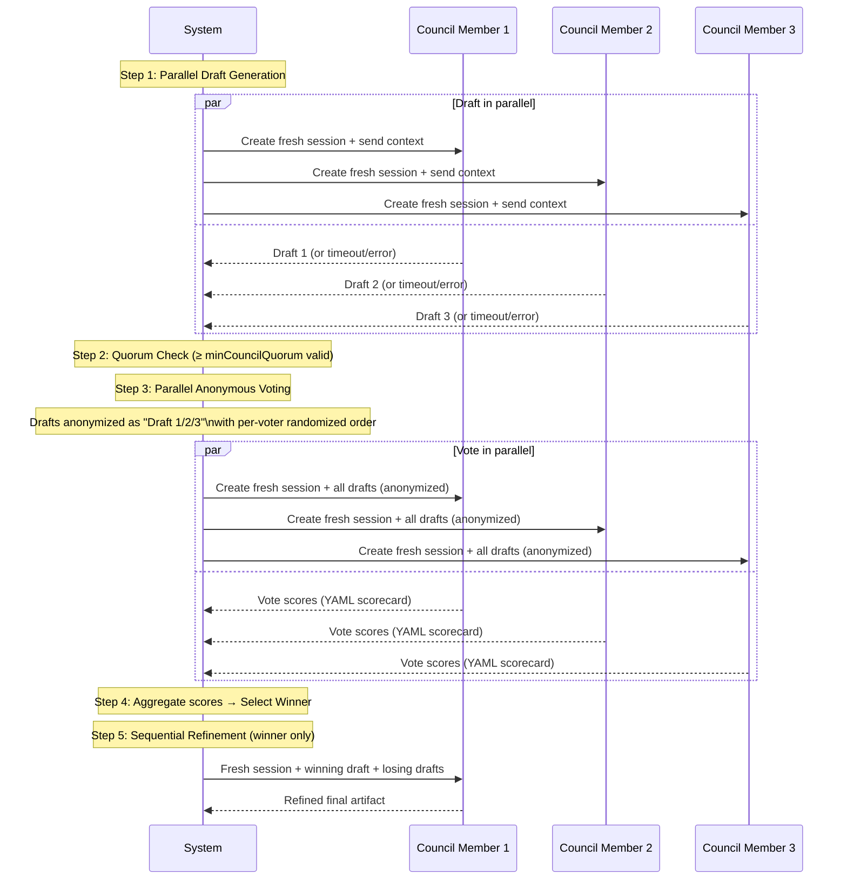
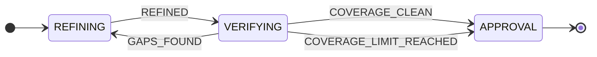

# The LLM Council

The LLM Council is LoopTroop's mechanism for producing high-quality planning artifacts through multi-model debate. Every planning phase — Interview, PRD, and Beads — is produced by a council of AI models that independently draft, cross-evaluate, and collaboratively refine the output.

---

## Table of Contents

1. [Why a Council?](#why-a-council)
2. [Council Configuration](#council-configuration)
3. [The Pipeline: Draft → Vote → Refine](#the-pipeline-draft--vote--refine)
4. [Step 1: Parallel Draft Generation](#step-1-parallel-draft-generation)
5. [Step 2: Quorum Check](#step-2-quorum-check)
6. [Step 3: Parallel Anonymous Voting](#step-3-parallel-anonymous-voting)
7. [Step 4: Winner Selection](#step-4-winner-selection)
8. [Step 5: Sequential Refinement](#step-5-sequential-refinement)
9. [Coverage Verification Loop](#coverage-verification-loop)
10. [Voting Rubrics](#voting-rubrics)
11. [Session Lifecycle](#session-lifecycle)
12. [Timeouts & Member Outcomes](#timeouts--member-outcomes)
13. [Code Reference](#code-reference)

---

## Why a Council?

A single model has blind spots. Different models excel at different dimensions:
- Some are better at edge-case identification.
- Some are better at technical correctness.
- Some are better at decomposition and structure.

By running multiple models independently and having them evaluate each other's work anonymously, LoopTroop achieves **emergent quality** that exceeds any individual model's output. The rubric-based voting system ensures evaluation is structured and reproducible, not a vibes-based "which sounds better" comparison.

---

## Council Configuration

Council membership is configured in the user Profile and **locked** when a ticket is started:

| Setting | Default | Description |
|---------|---------|-------------|
| `councilMembers` | (user-configured) | Up to 4 model IDs (e.g. `anthropic/claude-sonnet-4-5`) |
| `mainImplementer` | (user-configured) | Primary model; acts as a council member AND the execution model |
| `minCouncilQuorum` | 2 | Minimum number of valid responses required to proceed |
| `councilResponseTimeout` | 1,200,000 ms (20 min) | Max wall-clock time per draft/vote operation |

Once a ticket is started, the model selection is frozen in `lockedCouncilMembers` and `lockedMainImplementer` in the ticket row. Profile changes after start do not affect running tickets.

---

## The Pipeline: Draft → Vote → Refine



---

## Step 1: Parallel Draft Generation

**Module:** `server/council/drafter.ts` → `generateDrafts()`

All council members receive the same context (assembled by `buildMinimalContext()` for the relevant phase) and produce their drafts **simultaneously** via separate fresh OpenCode sessions.

Each draft attempt:
1. Creates a new OpenCode session via `SessionManager.createSessionForPhase()`
2. Sends the phase prompt + context parts
3. Streams the response
4. Validates the output against the phase's expected schema
5. On validation failure: attempts structured retry (up to `maxStructuredRetries`) within the same session
6. Records the final `DraftResult` with outcome, duration, content, and metadata

A `DraftResult` carries:

```typescript
interface DraftResult {
  memberId: string         // model ID (e.g. "anthropic/claude-sonnet-4-5")
  content: string          // Raw draft content
  outcome: MemberOutcome   // 'completed' | 'timed_out' | 'invalid_output' | 'failed'
  duration: number         // ms
  error?: string
  draftMetrics?: DraftMetrics  // questionCount, epicCount, beadCount, etc.
  structuredOutput?: DraftStructuredOutputMeta
}
```

---

## Step 2: Quorum Check

**Module:** `server/council/quorum.ts`

After drafts are collected, LoopTroop checks that at least `minCouncilQuorum` (default: 2) members produced valid (`completed`) responses.

If fewer valid responses exist:
- The pipeline throws an error
- The ticket transitions to `BLOCKED_ERROR`
- The user can retry with the same or different models

Quorum is checked twice: after draft generation and after voting.

---

## Step 3: Parallel Anonymous Voting

**Module:** `server/council/voter.ts` → `conductVoting()`

Each council member receives **all drafts** simultaneously and scores every draft against the rubric. To prevent positional bias and identity bias:

- **Anonymization** — Drafts are relabelled as `Draft 1`, `Draft 2`, etc. (authorship hidden).
- **Per-voter randomized order** — Each voter sees the drafts in a different randomized order, generated from a **deterministic seed** (`voterId + phase + timestamp`) using a custom seeded PRNG. This means tie-breaking is reproducible.

Each voter returns a YAML scorecard:

```yaml
draft_scores:
  Draft 1:
    Coverage of requirements: 18
    Correctness / feasibility: 17
    Testability: 16
    Minimal complexity / good decomposition: 19
    Risks / edge cases addressed: 15
    total_score: 85
  Draft 2:
    ...
```

The system validates the scorecard schema and applies structured retry on malformed responses.

---

## Step 4: Winner Selection

**Module:** `server/council/voter.ts` → `selectWinner()`

1. Aggregate all vote scores for each draft across all voters.
2. The draft with the highest total aggregate score wins.
3. **Tie-break** — If two or more drafts tie, the main implementer's draft wins (it is considered the "home team" tie-breaker as specified in `architecture.md §3.3`).

The `winnerId` (member model ID) and `winnerContent` are returned and passed to the refinement step.

---

## Step 5: Sequential Refinement

**Module:** `server/council/refiner.ts` → `refineDraft()`

The winning member receives:
- Its own winning draft
- All **completed** losing drafts
- The same context parts (possibly rebuilt by `contextBuilder` callback)

The winning model's task: incorporate only the genuinely valuable ideas from the losing drafts into its own draft, without degrading it. This is a **winner-only, sequential** operation — not parallel.

The result is `refinedContent`, which becomes the canonical artifact for the phase (stored as a phase artifact in the database and written to disk as YAML).

---

## Coverage Verification Loop

After refinement, a coverage check is run by the **winner model only** to verify the artifact covers all required inputs:

| Phase | Coverage checks against |
|-------|------------------------|
| Interview | Ticket description + requirements |
| PRD | Final Interview Results |
| Beads | Every PRD acceptance criterion |

If gaps are found (`GAPS_FOUND`), the state machine re-enters the refinement state. The coverage loop is bounded by `maxCoveragePasses` (default: 2) and `coverageFollowUpBudgetPercent` (default: 20% additional follow-ups). When the limit is reached, `COVERAGE_LIMIT_REACHED` is emitted and the ticket proceeds to approval regardless.



---

## Voting Rubrics

Each phase has its own tailored 5-category rubric, with each category worth 20 points (max score = 100).

### Interview Question Rubric

| Category | Weight | Description |
|----------|--------|-------------|
| Coverage of requirements | 20 | Questions address all areas needed to write a PRD: features, constraints, non-goals, acceptance criteria |
| Correctness / feasibility | 20 | Questions are unambiguous, well-formed, and answerable by the target user |
| Testability | 20 | Answers would yield verifiable, measurable PRD requirements |
| Minimal complexity / good decomposition | 20 | Logical flow (Foundation → Structure → Assembly), no redundant questions |
| Risks / edge cases addressed | 20 | Questions surface constraints, failure modes, non-goals, and blockers |

### PRD Rubric

| Category | Weight | Description |
|----------|--------|-------------|
| Coverage of requirements | 20 | PRD fully addresses all Interview Results |
| Correctness / feasibility | 20 | Requirements are technically sound and achievable |
| Testability | 20 | Each requirement and acceptance criterion is measurable and verifiable |
| Minimal complexity / good decomposition | 20 | Epics and user stories are well-structured with detailed implementation steps |
| Risks / edge cases addressed | 20 | Error states, performance constraints, security concerns documented |

### Beads Rubric

| Category | Weight | Description |
|----------|--------|-------------|
| Coverage of PRD requirements | 20 | Every in-scope user story maps to at least one bead |
| Correctness / feasibility of technical approach | 20 | Bead descriptions are technically sound; test commands are valid |
| Quality and isolation of bead-scoped tests | 20 | Each bead defines its own targeted tests with clear pass/fail criteria |
| Minimal complexity / good dependency management | 20 | Beads are smallest independently completable units; no circular dependencies |
| Risks / edge cases addressed | 20 | Failure modes, retry scenarios, anti-patterns captured per bead |

---

## Session Lifecycle

Every council operation uses **fresh, isolated OpenCode sessions** — never reusing sessions across phases or steps:

| Operation | Session Strategy |
|-----------|-----------------|
| Draft generation | 1 fresh session per member per phase attempt |
| Voting | 1 fresh session per member per phase attempt |
| Refinement | 1 fresh session for winner only |
| Coverage verification | 1 fresh session for winner only |
| Interview Q&A | 1 fresh session per question batch |
| PRD full_answers compilation | 1 fresh session (own sub-step) |

On retry/context wipe, always start a new session for the new attempt. Failed attempt session history is never reused. Sessions are tracked in the `opencode_sessions` SQLite table with full ownership metadata (`ticketId`, `phase`, `phaseAttempt`, `memberId`, `step`).

---

## Timeouts & Member Outcomes

Each member's outcome is independently tracked:

| Outcome | Meaning |
|---------|---------|
| `pending` | Request dispatched; awaiting response |
| `completed` | Valid response received within timeout |
| `timed_out` | No response before `councilResponseTimeout` (default: 20 min) |
| `invalid_output` | Response received but failed schema validation after all retries |
| `failed` | Hard error (e.g., connection reset, provider error) |

All outcomes are recorded in phase artifacts for auditability and displayed in the ticket's Phase Log UI.

---

## Code Reference

| File | Responsibility |
|------|---------------|
| `server/council/pipeline.ts` | `runCouncilPipeline()` — orchestrates all 5 steps |
| `server/council/drafter.ts` | `generateDrafts()` — parallel draft generation |
| `server/council/voter.ts` | `conductVoting()`, `selectWinner()`, `buildVotePresentationOrder()` |
| `server/council/refiner.ts` | `refineDraft()` — sequential winner refinement |
| `server/council/quorum.ts` | `checkQuorum()`, `checkMemberResponseQuorum()` |
| `server/council/types.ts` | All council types + voting rubric constants |
| `server/council/members.ts` | Council member resolution from profile |
