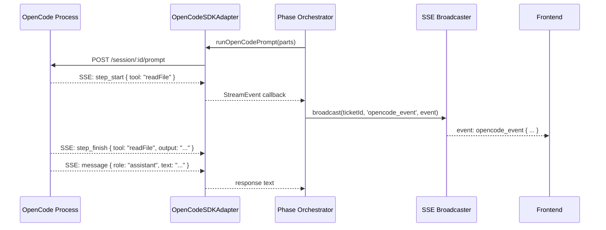

# OpenCode Integration

LoopTroop uses [OpenCode](https://opencode.ai) as its AI execution engine. This document explains the adapter pattern, session lifecycle management, SSE streaming, and the mock mode available for development.

---

## Table of Contents

1. [What is OpenCode?](#what-is-opencode)
2. [The Adapter Pattern](#the-adapter-pattern)
3. [Factory: Real vs Mock](#factory-real-vs-mock)
4. [Session Lifecycle](#session-lifecycle)
5. [Session Ownership Tracking](#session-ownership-tracking)
6. [Running Prompts](#running-prompts)
7. [SSE Streaming](#sse-streaming)
8. [Session Reconnect Policy](#session-reconnect-policy)
9. [Mock Mode](#mock-mode)
10. [Health Check](#health-check)

---

## What is OpenCode?

OpenCode is a local AI coding agent that:
- Runs as a separate process on the developer's machine
- Receives prompts and has access to the project's file system
- Can run terminal commands, read/write files, and execute tests
- Streams output as Server-Sent Events
- Manages sessions (conversation + tool call history) persistently

LoopTroop orchestrates OpenCode sessions — it doesn't interact with AI models directly. LoopTroop is the conductor; OpenCode is the AI worker.

---

## The Adapter Pattern

All OpenCode interactions go through a single `OpenCodeAdapter` interface:

```typescript
// server/opencode/adapter.ts
interface OpenCodeAdapter {
  createSession(projectPath, signal?, options?): Promise<Session>
  promptSession(sessionId, parts, signal?, options?): Promise<string>
  listSessions(): Promise<Session[]>
  getSessionMessages(sessionId): Promise<Message[]>
  subscribeToEvents(sessionId, signal?, stepFinishSafetyMs?): AsyncGenerator<StreamEvent>
  listPendingQuestions(projectPath?, signal?): Promise<OpenCodeQuestionRequest[]>
  replyQuestion(requestId, answers, projectPath?, signal?): Promise<void>
  rejectQuestion(requestId, projectPath?, signal?): Promise<void>
  abortSession(sessionId): Promise<boolean>
  assembleBeadContext(ticketId, beadId): Promise<PromptPart[]>
  assembleCouncilContext(ticketId, phase): Promise<PromptPart[]>
  checkHealth(): Promise<HealthStatus>
}
```

**Key design benefits:**
- **Testability** — swap `OpenCodeSDKAdapter` with `MockOpenCodeAdapter` without changing any orchestration code
- **Single dependency point** — all OpenCode-specific SDK code is isolated in `adapter.ts`
- **Type safety** — all types re-exported from `server/opencode/types.ts` (wrappers over the SDK types)

The concrete production implementation is `OpenCodeSDKAdapter`, which wraps `@opencode-ai/sdk`'s v2 client.

---

## Factory: Real vs Mock

**Module:** `server/opencode/factory.ts`

```typescript
export function getOpenCodeAdapter(): OpenCodeAdapter {
  if (singleton) return singleton
  singleton = isMockOpenCodeMode()
    ? new MockOpenCodeAdapter()
    : new OpenCodeSDKAdapter(getOpenCodeBaseUrl())
  return singleton
}

export function isMockOpenCodeMode(): boolean {
  return process.env.LOOPTROOP_OPENCODE_MODE === 'mock'
}
```

The adapter is a **singleton** — created once on first access and reused for the server's lifetime. This prevents multiple adapters from opening competing SSE streams.

The base URL for the real adapter is resolved via `getOpenCodeBaseUrl()` from `server/opencode/runtimeConfig.ts`, which reads the OpenCode process's socket or HTTP port.

---

## Session Lifecycle

Every distinct AI task maps to exactly **one OpenCode session**. Sessions are never reused across tasks.

```
Task Type              → Session scope
──────────────────────────────────────
Council member draft   → 1 session per member per phase
Council vote           → 1 session per member per phase
Coverage verification  → 1 session (winner only)
Bead execution (iter)  → 1 session per iteration
Context wipe note      → Same session as the dying bead iteration
Execution setup run    → 1 session
Final test             → 1 session
```

The `SessionManager` class in `server/opencode/sessionManager.ts` handles session creation with ownership registration:

```typescript
class SessionManager {
  async createSessionForPhase(
    ticketId, phase, phaseAttempt, memberId?, beadId?, iteration?, step?, projectPath?
  ): Promise<Session>

  async completeSession(sessionId): Promise<void>
  async abandonSession(sessionId): Promise<void>
}
```

On creation, a record is inserted into `opencode_sessions` with:
- `state: 'active'`
- Full ownership metadata (ticketId, phase, phaseAttempt, memberId, beadId, iteration)

On completion or abandonment, the state is updated accordingly.

---

## Session Ownership Tracking

The `opencode_sessions` table maps every session ID to its owner. This enables:

1. **Crash recovery** — On server restart, all sessions with `state: 'active'` can be inspected and cleaned up or reconnected.
2. **Abort propagation** — When a ticket is cancelled, `abortTicketSessions(ticketId)` calls `adapter.abortSession()` for all active sessions belonging to that ticket.
3. **Audit** — Full history of which model handled which bead at which iteration.

```typescript
// server/opencode/sessionManager.ts
export function listOpenCodeSessionsForTicket(
  ticketId: string,
  states: string[] = ['active']
): OpenCodeSessionRecord[]

export async function abortTicketSessions(ticketId: string): Promise<void>
```

---

## Running Prompts

LoopTroop has two helper functions in `server/workflow/runOpenCodePrompt.ts`:

### `runOpenCodePrompt()`

Creates a **new session** and runs a prompt. Used for all first-iteration bead execution, council drafts, council votes, etc.

```typescript
interface RunOpenCodePromptOptions {
  adapter: OpenCodeAdapter
  projectPath: string
  parts: PromptPart[]
  signal?: AbortSignal
  timeoutMs?: number
  model?: string
  variant?: string
  erroredSessionPolicy: 'discard_errored_session_output' | 'use_errored_session_output'
  toolPolicy?: ToolPolicy
  sessionOwnership?: SessionOwnership
  onSessionCreated?: (session: Session) => void
  onStreamEvent?: (event: StreamEvent) => void
  onPromptDispatched?: (event: OpenCodePromptDispatchEvent) => void
  onPromptCompleted?: (event: OpenCodePromptCompletedEvent) => void
}
```

The `sessionOwnership` parameter is optional — when provided, the session is registered in `opencode_sessions`.

### `runOpenCodeSessionPrompt()`

Sends a prompt to an **existing session** (continuation prompts, structured retries, context wipe notes). Does not create a new session — it reuses the one provided.

```typescript
interface RunOpenCodeSessionPromptOptions {
  adapter: OpenCodeAdapter
  session: Session
  parts: PromptPart[]
  // ... same callbacks
}
```

Both functions:
- Apply the per-prompt timeout via `AbortSignal.timeout()`
- Stream all events through `adapter.subscribeToEvents()`
- Collect the full text response
- Handle `erroredSessionPolicy`: if `'discard_errored_session_output'`, a session that errors out returns an empty response rather than a partial one

---

## SSE Streaming

OpenCode streams execution events via SSE. LoopTroop subscribes to these events, processes them, and re-broadcasts them to the frontend via its own SSE broadcaster.



### StreamEvent Types

| Type | Description |
|------|-------------|
| `step_start` | A tool call has started (e.g. "Reading file") |
| `step_finish` | A tool call has completed (with output/error) |
| `message` | Text from the model |
| `message_part` | Streaming text token |
| `reasoning` | Model reasoning/thinking content |
| `error` | Session error |

The frontend `CodingView` and `CouncilView` display these events live as they stream in.

---

## Session Reconnect Policy

If the SSE stream from OpenCode drops mid-session (e.g., a transient network issue), LoopTroop does **not** automatically reconnect during the current prompt. Instead:

1. The prompt times out and is treated as a failed iteration.
2. A Context Wipe Note is generated from whatever messages were captured.
3. A fresh session starts for the next iteration.

This is intentional. A dropped stream is treated the same as a timeout — it triggers the bounded retry mechanism rather than attempting transparent reconnection that could cause duplicate tool calls.

The `lastEventId` and `lastEventAt` fields in `opencode_sessions` are tracked for potential future use in more sophisticated reconnect scenarios.

---

## Mock Mode

Set `LOOPTROOP_OPENCODE_MODE=mock` to use the `MockOpenCodeAdapter` instead of the real SDK.

```bash
LOOPTROOP_OPENCODE_MODE=mock npm run dev:backend
```

The `MockOpenCodeAdapter` (`server/opencode/mockAdapter.ts`):
- Returns deterministic fake responses for each prompt type
- Simulates streaming with artificial delays
- Does **not** require an OpenCode process to be running
- Generates syntactically valid YAML/JSON artifacts that pass format validation

This is used extensively in integration tests and for UI development without needing the full AI stack running.

---

## Health Check

The backend exposes `GET /health` which internally calls `adapter.checkHealth()`:

```typescript
async checkHealth(): Promise<HealthStatus> {
  // Pings OpenCode's /health endpoint
  // Returns { status: 'ok' | 'degraded' | 'unavailable', latencyMs }
}
```

The frontend's `useStartupStatus` hook polls this on load and shows a warning banner if OpenCode is not reachable.

→ See [Execution Loop](execution-loop.md) for how sessions are used during bead execution  
→ See [LLM Council](llm-council.md) for how council sessions are orchestrated  
→ See [Setup Guide](setup-guide.md) for how to start OpenCode alongside LoopTroop
