# State Machine

LoopTroop's entire ticket lifecycle is modelled as an **XState v5 finite state machine** (`server/machines/ticketMachine.ts`). This document is the authoritative map of every state, every event, and every transition.

---

## Table of Contents

1. [Overview](#overview)
2. [Full State Diagram](#full-state-diagram)
3. [States Reference](#states-reference)
4. [Events Reference](#events-reference)
5. [BLOCKED_ERROR Recovery](#blocked_error-recovery)
6. [Kanban Phase Mapping](#kanban-phase-mapping)
7. [Context Shape](#context-shape)
8. [Persistence](#persistence)

---

## Overview

Every ticket is an instance of `ticketMachine`. The machine:
- Starts in `DRAFT`
- Advances through ~30 operational states
- Ends in `COMPLETED` or `CANCELED` (both terminal/final states)
- Falls into `BLOCKED_ERROR` on any recoverable failure, with automatic retry back to the failed state

The machine is persisted as a **JSON-serialised XState snapshot** in the `xstateSnapshot` column of the `tickets` SQLite table. On server restart, the actor is rehydrated from this snapshot and continues from exactly where it left off.

---

## Full State Diagram

```mermaid
stateDiagram-v2
    [*] --> DRAFT

    DRAFT --> SCANNING_RELEVANT_FILES : START
    DRAFT --> BLOCKED_ERROR : INIT_FAILED
    DRAFT --> CANCELED : CANCEL

    SCANNING_RELEVANT_FILES --> COUNCIL_DELIBERATING : RELEVANT_FILES_READY
    SCANNING_RELEVANT_FILES --> BLOCKED_ERROR : ERROR
    SCANNING_RELEVANT_FILES --> CANCELED : CANCEL

    COUNCIL_DELIBERATING --> COUNCIL_VOTING_INTERVIEW : QUESTIONS_READY
    COUNCIL_DELIBERATING --> BLOCKED_ERROR : ERROR
    COUNCIL_DELIBERATING --> CANCELED : CANCEL

    COUNCIL_VOTING_INTERVIEW --> COMPILING_INTERVIEW : WINNER_SELECTED
    COUNCIL_VOTING_INTERVIEW --> BLOCKED_ERROR : ERROR
    COUNCIL_VOTING_INTERVIEW --> CANCELED : CANCEL

    COMPILING_INTERVIEW --> WAITING_INTERVIEW_ANSWERS : READY
    COMPILING_INTERVIEW --> BLOCKED_ERROR : ERROR
    COMPILING_INTERVIEW --> CANCELED : CANCEL

    WAITING_INTERVIEW_ANSWERS --> WAITING_INTERVIEW_ANSWERS : BATCH_ANSWERED
    WAITING_INTERVIEW_ANSWERS --> VERIFYING_INTERVIEW_COVERAGE : INTERVIEW_COMPLETE
    WAITING_INTERVIEW_ANSWERS --> WAITING_INTERVIEW_APPROVAL : SKIP_ALL_TO_APPROVAL
    WAITING_INTERVIEW_ANSWERS --> BLOCKED_ERROR : ERROR
    WAITING_INTERVIEW_ANSWERS --> CANCELED : CANCEL

    VERIFYING_INTERVIEW_COVERAGE --> WAITING_INTERVIEW_APPROVAL : COVERAGE_CLEAN
    VERIFYING_INTERVIEW_COVERAGE --> WAITING_INTERVIEW_ANSWERS : GAPS_FOUND
    VERIFYING_INTERVIEW_COVERAGE --> WAITING_INTERVIEW_APPROVAL : COVERAGE_LIMIT_REACHED
    VERIFYING_INTERVIEW_COVERAGE --> BLOCKED_ERROR : ERROR
    VERIFYING_INTERVIEW_COVERAGE --> CANCELED : CANCEL

    WAITING_INTERVIEW_APPROVAL --> DRAFTING_PRD : APPROVE
    WAITING_INTERVIEW_APPROVAL --> BLOCKED_ERROR : ERROR
    WAITING_INTERVIEW_APPROVAL --> CANCELED : CANCEL

    DRAFTING_PRD --> COUNCIL_VOTING_PRD : DRAFTS_READY
    DRAFTING_PRD --> BLOCKED_ERROR : ERROR
    DRAFTING_PRD --> CANCELED : CANCEL

    COUNCIL_VOTING_PRD --> REFINING_PRD : WINNER_SELECTED
    COUNCIL_VOTING_PRD --> BLOCKED_ERROR : ERROR
    COUNCIL_VOTING_PRD --> CANCELED : CANCEL

    REFINING_PRD --> VERIFYING_PRD_COVERAGE : REFINED
    REFINING_PRD --> BLOCKED_ERROR : ERROR
    REFINING_PRD --> CANCELED : CANCEL

    VERIFYING_PRD_COVERAGE --> WAITING_PRD_APPROVAL : COVERAGE_CLEAN
    VERIFYING_PRD_COVERAGE --> REFINING_PRD : GAPS_FOUND
    VERIFYING_PRD_COVERAGE --> WAITING_PRD_APPROVAL : COVERAGE_LIMIT_REACHED
    VERIFYING_PRD_COVERAGE --> BLOCKED_ERROR : ERROR
    VERIFYING_PRD_COVERAGE --> CANCELED : CANCEL

    WAITING_PRD_APPROVAL --> DRAFTING_BEADS : APPROVE
    WAITING_PRD_APPROVAL --> BLOCKED_ERROR : ERROR
    WAITING_PRD_APPROVAL --> CANCELED : CANCEL

    DRAFTING_BEADS --> COUNCIL_VOTING_BEADS : DRAFTS_READY
    DRAFTING_BEADS --> BLOCKED_ERROR : ERROR
    DRAFTING_BEADS --> CANCELED : CANCEL

    COUNCIL_VOTING_BEADS --> REFINING_BEADS : WINNER_SELECTED
    COUNCIL_VOTING_BEADS --> BLOCKED_ERROR : ERROR
    COUNCIL_VOTING_BEADS --> CANCELED : CANCEL

    REFINING_BEADS --> VERIFYING_BEADS_COVERAGE : REFINED
    REFINING_BEADS --> BLOCKED_ERROR : ERROR
    REFINING_BEADS --> CANCELED : CANCEL

    VERIFYING_BEADS_COVERAGE --> WAITING_BEADS_APPROVAL : COVERAGE_CLEAN
    VERIFYING_BEADS_COVERAGE --> REFINING_BEADS : GAPS_FOUND
    VERIFYING_BEADS_COVERAGE --> WAITING_BEADS_APPROVAL : COVERAGE_LIMIT_REACHED
    VERIFYING_BEADS_COVERAGE --> BLOCKED_ERROR : ERROR
    VERIFYING_BEADS_COVERAGE --> CANCELED : CANCEL

    WAITING_BEADS_APPROVAL --> PRE_FLIGHT_CHECK : APPROVE
    WAITING_BEADS_APPROVAL --> BLOCKED_ERROR : ERROR
    WAITING_BEADS_APPROVAL --> CANCELED : CANCEL

    PRE_FLIGHT_CHECK --> WAITING_EXECUTION_SETUP_APPROVAL : CHECKS_PASSED
    PRE_FLIGHT_CHECK --> BLOCKED_ERROR : CHECKS_FAILED
    PRE_FLIGHT_CHECK --> BLOCKED_ERROR : ERROR
    PRE_FLIGHT_CHECK --> CANCELED : CANCEL

    WAITING_EXECUTION_SETUP_APPROVAL --> PREPARING_EXECUTION_ENV : APPROVE_EXECUTION_SETUP_PLAN
    WAITING_EXECUTION_SETUP_APPROVAL --> BLOCKED_ERROR : EXECUTION_SETUP_PLAN_FAILED
    WAITING_EXECUTION_SETUP_APPROVAL --> BLOCKED_ERROR : ERROR
    WAITING_EXECUTION_SETUP_APPROVAL --> CANCELED : CANCEL

    PREPARING_EXECUTION_ENV --> CODING : EXECUTION_SETUP_READY
    PREPARING_EXECUTION_ENV --> BLOCKED_ERROR : EXECUTION_SETUP_FAILED
    PREPARING_EXECUTION_ENV --> BLOCKED_ERROR : ERROR
    PREPARING_EXECUTION_ENV --> CANCELED : CANCEL

    CODING --> RUNNING_FINAL_TEST : BEAD_COMPLETE [allBeadsComplete]
    CODING --> CODING : BEAD_COMPLETE [not allBeadsComplete]
    CODING --> RUNNING_FINAL_TEST : ALL_BEADS_DONE
    CODING --> BLOCKED_ERROR : BEAD_ERROR
    CODING --> BLOCKED_ERROR : ERROR
    CODING --> CANCELED : CANCEL

    RUNNING_FINAL_TEST --> INTEGRATING_CHANGES : TESTS_PASSED
    RUNNING_FINAL_TEST --> BLOCKED_ERROR : TESTS_FAILED
    RUNNING_FINAL_TEST --> BLOCKED_ERROR : ERROR
    RUNNING_FINAL_TEST --> CANCELED : CANCEL

    INTEGRATING_CHANGES --> CREATING_PULL_REQUEST : INTEGRATION_DONE
    INTEGRATING_CHANGES --> BLOCKED_ERROR : ERROR
    INTEGRATING_CHANGES --> CANCELED : CANCEL

    CREATING_PULL_REQUEST --> WAITING_PR_REVIEW : PULL_REQUEST_READY
    CREATING_PULL_REQUEST --> BLOCKED_ERROR : ERROR
    CREATING_PULL_REQUEST --> CANCELED : CANCEL

    WAITING_PR_REVIEW --> CLEANING_ENV : MERGE_COMPLETE
    WAITING_PR_REVIEW --> CLEANING_ENV : CLOSE_UNMERGED_COMPLETE
    WAITING_PR_REVIEW --> BLOCKED_ERROR : ERROR
    WAITING_PR_REVIEW --> CANCELED : CANCEL

    CLEANING_ENV --> COMPLETED : CLEANUP_DONE
    CLEANING_ENV --> BLOCKED_ERROR : ERROR
    CLEANING_ENV --> CANCELED : CANCEL

    BLOCKED_ERROR --> DRAFT : RETRY [previousStatus == DRAFT]
    BLOCKED_ERROR --> SCANNING_RELEVANT_FILES : RETRY [previousStatus == SCANNING_RELEVANT_FILES]
    note right of BLOCKED_ERROR : RETRY transitions back\nto previousStatus\n(30 guards, one per state)
    BLOCKED_ERROR --> CANCELED : CANCEL

    COMPLETED --> [*]
    CANCELED --> [*]
```



---

## States Reference

### Setup Phase

| State | Kanban Column | Description |
|-------|---------------|-------------|
| `DRAFT` | **To Do** | Ticket created. Waiting for user to press Start. Models are locked at this point if overrides are provided. |

### Interview Phase

| State | Kanban Column | Description |
|-------|---------------|-------------|
| `SCANNING_RELEVANT_FILES` | In Progress | Generates `codebase-map.yaml` by scanning the project directory. Identifies files relevant to the ticket. |
| `COUNCIL_DELIBERATING` | In Progress | All council members independently draft interview question sets in parallel. |
| `COUNCIL_VOTING_INTERVIEW` | In Progress | All council members score all question-set drafts anonymously. Winner selected by highest aggregate score. |
| `COMPILING_INTERVIEW` | In Progress | Winning model refines its question set by incorporating valuable ideas from losing drafts. |
| `WAITING_INTERVIEW_ANSWERS` | **Needs Input** | User answers AI-generated questions one batch at a time. Batches of up to 3 questions (configurable). Self-loops on `BATCH_ANSWERED`. |
| `VERIFYING_INTERVIEW_COVERAGE` | In Progress | Winner-only pass: AI checks if all answers are complete and no critical questions were missed. Can send `GAPS_FOUND` to loop back. |
| `WAITING_INTERVIEW_APPROVAL` | **Needs Input** | User reviews, optionally edits, then approves the final Interview Results YAML. |

### PRD Phase

| State | Kanban Column | Description |
|-------|---------------|-------------|
| `DRAFTING_PRD` | In Progress | All council members independently draft a full PRD (Epics + User Stories). |
| `COUNCIL_VOTING_PRD` | In Progress | All council members score all PRD drafts. Winner selected. |
| `REFINING_PRD` | In Progress | Winning model refines its PRD draft by incorporating ideas from losing drafts. |
| `VERIFYING_PRD_COVERAGE` | In Progress | Winner-only coverage check against Interview Results. Can loop back to `REFINING_PRD`. |
| `WAITING_PRD_APPROVAL` | **Needs Input** | User reviews and approves the final PRD YAML. |

### Beads Phase

| State | Kanban Column | Description |
|-------|---------------|-------------|
| `DRAFTING_BEADS` | In Progress | All council members independently draft a Beads decomposition of the PRD. |
| `COUNCIL_VOTING_BEADS` | In Progress | All council members score all Beads drafts. |
| `REFINING_BEADS` | In Progress | Winning model refines its Beads draft. |
| `VERIFYING_BEADS_COVERAGE` | In Progress | Coverage check: every PRD acceptance criterion must map to at least one bead. |
| `WAITING_BEADS_APPROVAL` | **Needs Input** | User reviews and approves the final Beads list (issues.jsonl). |

### Execution Phase

| State | Kanban Column | Description |
|-------|---------------|-------------|
| `PRE_FLIGHT_CHECK` | In Progress | Doctor diagnostics: model ping, git status, directory permissions, environment validation. Blocks on failure. |
| `WAITING_EXECUTION_SETUP_APPROVAL` | **Needs Input** | AI generates an execution setup plan (dependency install commands, env setup). User reviews and approves. |
| `PREPARING_EXECUTION_ENV` | In Progress | Executes the approved setup plan to prepare the worktree environment. |
| `CODING` | In Progress | Executes Beads sequentially. Self-loops on `BEAD_COMPLETE` until `allBeadsComplete` guard passes. |

### Delivery Phase

| State | Kanban Column | Description |
|-------|---------------|-------------|
| `RUNNING_FINAL_TEST` | In Progress | Runs the full test suite on the complete implementation (all beads merged). |
| `INTEGRATING_CHANGES` | In Progress | Squashes per-bead commits into a clean, presentable commit history. |
| `CREATING_PULL_REQUEST` | In Progress | Creates a PR on the remote repository. |
| `WAITING_PR_REVIEW` | **Needs Input** | Ticket waits for the user to merge or close the PR. |
| `CLEANING_ENV` | In Progress | Removes worktree artefacts, releases locks, cleans temporary files. |

### Terminal States

| State | Kanban Column | Description |
|-------|---------------|-------------|
| `COMPLETED` | **Done** | Ticket finished successfully. Final state. |
| `CANCELED` | **Done** | Ticket was manually canceled. Final state. |

### Error State

| State | Kanban Column | Description |
|-------|---------------|-------------|
| `BLOCKED_ERROR` | **Needs Input** | Any phase failed. Stores `error`, `errorCodes[]`, and `previousStatus`. User can retry or cancel. |

---

## Events Reference

| Event | Emitted By | Description |
|-------|-----------|-------------|
| `START` | User (via API) | Begins execution. Locks model selection into the ticket context. |
| `INIT_FAILED` | System | Worktree/git initialization failed. |
| `RELEVANT_FILES_READY` | System | Codebase scan complete. |
| `QUESTIONS_READY` | System | Council draft phase complete; question set ready. |
| `WINNER_SELECTED` | System | Voting complete; winner identified. |
| `READY` | System | Interview questions compiled and ready for user. |
| `BATCH_ANSWERED` | User (via API) | User submitted a batch of answers. |
| `INTERVIEW_COMPLETE` | User (via API) | User answered all questions. |
| `SKIP_ALL_TO_APPROVAL` | User (via API) | User skips remaining questions and proceeds directly to approval. |
| `COVERAGE_CLEAN` | System | Coverage verification passed with no gaps. |
| `GAPS_FOUND` | System | Coverage verification found missing areas; refinement re-entered. |
| `COVERAGE_LIMIT_REACHED` | System | Max coverage passes reached (`maxCoveragePasses`, default 2); proceeds anyway. |
| `APPROVE` | User (via API) | Generic approval event for Interview/PRD/Beads approval gates. |
| `DRAFTS_READY` | System | All council drafts generated. |
| `REFINED` | System | Winner refinement complete. |
| `CHECKS_PASSED` | System | Pre-flight all checks passed. |
| `CHECKS_FAILED` | System | Pre-flight check found blocking issues. |
| `EXECUTION_SETUP_PLAN_READY` | System | AI-generated setup plan ready for review (internal; does not transition state). |
| `REGENERATE_EXECUTION_SETUP_PLAN` | User (via API) | User requests a new setup plan. |
| `APPROVE_EXECUTION_SETUP_PLAN` | User (via API) | User approves the execution setup plan. |
| `EXECUTION_SETUP_PLAN_FAILED` | System | Setup plan generation failed. |
| `EXECUTION_SETUP_READY` | System | Environment preparation complete. |
| `EXECUTION_SETUP_FAILED` | System | Environment preparation failed. |
| `BEAD_COMPLETE` | System | One bead finished successfully. Transitions to `RUNNING_FINAL_TEST` if `allBeadsComplete` guard is true; otherwise stays in `CODING`. |
| `ALL_BEADS_DONE` | System | Explicit signal that all beads are done (fallback). |
| `BEAD_ERROR` | System | A bead failed and exhausted all retry iterations. |
| `TESTS_PASSED` | System | Final test suite passed. |
| `TESTS_FAILED` | System | Final test suite failed. |
| `INTEGRATION_DONE` | System | Squash/integration complete. |
| `PULL_REQUEST_READY` | System | PR created on remote. |
| `MERGE_COMPLETE` | User (via API) | User merged the PR. |
| `CLOSE_UNMERGED_COMPLETE` | User (via API) | User closed the PR without merging. |
| `CLEANUP_DONE` | System | Environment cleanup complete. |
| `RETRY` | User (via API) | Retry from `BLOCKED_ERROR`. Returns to `previousStatus`. |
| `CANCEL` | User (via API) | Cancel from any state. |
| `ERROR` | System | Generic error — transitions to `BLOCKED_ERROR`. |

---

## BLOCKED_ERROR Recovery

`BLOCKED_ERROR` stores the `previousStatus` in the machine context. The `RETRY` event is handled with one guard per state (30 total), each checking `context.previousStatus`:

```typescript
{ guard: ({ context }) => context.previousStatus === 'DRAFTING_PRD', 
  target: 'DRAFTING_PRD', 
  actions: ['clearError'] }
```

If no guard matches (fallback), the machine retries from `DRAFT`.

The `clearError` action resets `context.error` and `context.errorCodes` to their empty defaults before re-entering the target state.

This means a retry is **idempotent** — the phase will re-run from scratch as if the error never happened, but with any artifacts from the previous attempt still available in the database.

---

## Kanban Phase Mapping

The `STATUS_TO_PHASE` record (`server/machines/types.ts`) maps every state to one of four Kanban board columns:

| Kanban Column | States |
|---------------|--------|
| **To Do** | `DRAFT` |
| **In Progress** | All automated processing states (`SCANNING_*`, `COUNCIL_*`, `DRAFTING_*`, `REFINING_*`, `CODING`, `RUNNING_*`, `INTEGRATING_*`, `CREATING_*`, `CLEANING_*`, `PREPARING_*`, `VERIFYING_*`, `COMPILING_*`) |
| **Needs Input** | `WAITING_INTERVIEW_ANSWERS`, `WAITING_INTERVIEW_APPROVAL`, `WAITING_PRD_APPROVAL`, `WAITING_BEADS_APPROVAL`, `WAITING_EXECUTION_SETUP_APPROVAL`, `WAITING_PR_REVIEW`, `BLOCKED_ERROR` |
| **Done** | `COMPLETED`, `CANCELED` |

---

## Context Shape

The machine context (`TicketContext`) carries all runtime state alongside the ticket's status:

```typescript
interface TicketContext {
  ticketId: string
  projectId: number
  externalId: string          // Human-readable ID, e.g. "PROJ-12"
  title: string
  status: string              // Current state name
  previousStatus: string | null  // For BLOCKED_ERROR recovery

  // Locked at ticket Start (frozen from profile defaults)
  lockedMainImplementer: string | null
  lockedMainImplementerVariant: string | null
  lockedCouncilMembers: string[] | null
  lockedCouncilMemberVariants: Record<string, string> | null
  lockedInterviewQuestions: number | null
  lockedCoverageFollowUpBudgetPercent: number | null
  lockedMaxCoveragePasses: number | null

  // Error tracking
  error: string | null
  errorCodes: string[]

  // Bead progress
  beadProgress: { total: number; completed: number; current: string | null }
  iterationCount: number
  maxIterations: number        // Default: 5

  councilResults: Record<string, unknown> | null
  createdAt: string
  updatedAt: string
}
```

---

## Persistence

The XState actor snapshot is serialised and stored in `tickets.xstateSnapshot` (JSON string) every time the machine transitions. On server startup, `server/startup.ts` rehydrates all non-terminal ticket actors from their stored snapshots.

See also: [Database Schema](database-schema.md) · [OpenCode Integration](opencode-integration.md)
