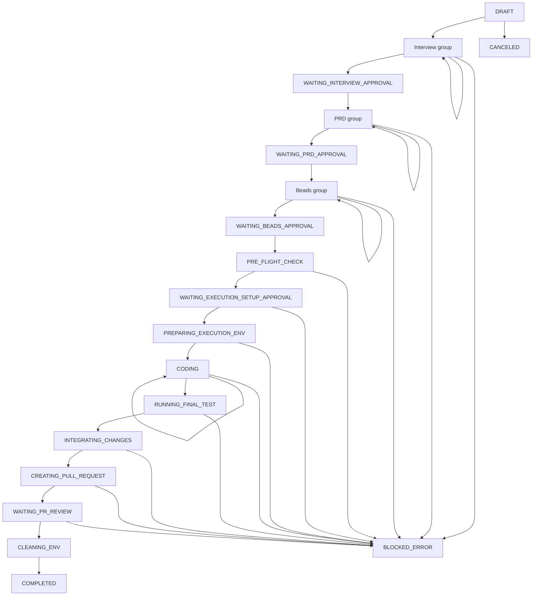

# State Machine

The current workflow source of truth is `shared/workflowMeta.ts`.

LoopTroop does not have a tiny status list. It has a staged workflow that separates backlog, interview, PRD, beads, execution, approval, delivery, cancellation, and blocked recovery states.

## Workflow Groups

| Group id | Label |
| --- | --- |
| `todo` | To Do |
| `interview` | Interview |
| `prd` | Specs (PRD) |
| `beads` | Blueprint (Beads) |
| `execution` | Execution |
| `done` | Done |

## Phase Inventory

| Phase | Label | Group | `uiView` | Review artifact | Editable | Multi-model logs | Progress kind |
| --- | --- | --- | --- | --- | --- | --- | --- |
| `DRAFT` | Backlog | `todo` | `draft` | — | yes | no | — |
| `SCANNING_RELEVANT_FILES` | Scanning Relevant Files | `interview` | `council` | — | yes | no | — |
| `COUNCIL_DELIBERATING` | AI Council Thinking | `interview` | `council` | — | yes | yes | — |
| `COUNCIL_VOTING_INTERVIEW` | Selecting Best Questions | `interview` | `council` | — | yes | yes | — |
| `COMPILING_INTERVIEW` | Preparing Interview | `interview` | `council` | — | yes | no | — |
| `WAITING_INTERVIEW_ANSWERS` | Interviewing | `interview` | `interview_qa` | — | yes | no | `questions` |
| `VERIFYING_INTERVIEW_COVERAGE` | Coverage Check (Interview) | `interview` | `council` | — | yes | no | — |
| `WAITING_INTERVIEW_APPROVAL` | Approving Interview | `interview` | `approval` | `interview` | yes | no | — |
| `DRAFTING_PRD` | Drafting Specs | `prd` | `council` | — | yes | yes | — |
| `COUNCIL_VOTING_PRD` | Voting on Specs | `prd` | `council` | — | yes | yes | — |
| `REFINING_PRD` | Refining Specs | `prd` | `council` | — | yes | no | — |
| `VERIFYING_PRD_COVERAGE` | Coverage Check (PRD) | `prd` | `council` | — | yes | no | — |
| `WAITING_PRD_APPROVAL` | Approving Specs | `prd` | `approval` | `prd` | yes | no | — |
| `DRAFTING_BEADS` | Architecting Beads | `beads` | `council` | — | yes | yes | — |
| `COUNCIL_VOTING_BEADS` | Voting on Architecture | `beads` | `council` | — | yes | yes | — |
| `REFINING_BEADS` | Finalizing Plan | `beads` | `council` | — | yes | no | — |
| `VERIFYING_BEADS_COVERAGE` | Coverage Check (Beads) | `beads` | `council` | — | yes | no | — |
| `WAITING_BEADS_APPROVAL` | Approving Blueprint | `beads` | `approval` | `beads` | yes | no | — |
| `PRE_FLIGHT_CHECK` | Initializing Agent | `execution` | `coding` | — | yes | no | — |
| `WAITING_EXECUTION_SETUP_APPROVAL` | Approve Workspace Setup | `execution` | `approval` | `execution_setup_plan` | yes | no | — |
| `PREPARING_EXECUTION_ENV` | Preparing Workspace Runtime | `execution` | `coding` | — | no | no | — |
| `CODING` | Implementing (Bead ?/?) | `execution` | `coding` | — | no | no | `beads` |
| `RUNNING_FINAL_TEST` | Self-Testing | `execution` | `coding` | — | no | no | — |
| `INTEGRATING_CHANGES` | Finalizing Code | `execution` | `coding` | — | no | no | — |
| `CREATING_PULL_REQUEST` | Creating PR | `execution` | `coding` | — | no | no | — |
| `WAITING_PR_REVIEW` | Review Draft PR | `execution` | `coding` | — | no | no | — |
| `CLEANING_ENV` | Cleaning Up | `execution` | `coding` | — | no | no | — |
| `COMPLETED` | Done | `done` | `done` | — | no | no | — |
| `CANCELED` | Canceled | `done` | `canceled` | — | no | no | — |
| `BLOCKED_ERROR` | Error (reason) | `execution` | `error` | — | no | no | — |

## High-Level Flow

## Planning Loops

Three parts of the machine intentionally loop:

| Loop | Why it loops |
| --- | --- |
| Interview | Coverage may generate follow-up questions |
| PRD | Coverage may require another refinement pass |
| Beads | Coverage may require revision before execution |

These are bounded loops, not open-ended conversational cycles.

## Execution And Delivery States

The execution group is broader than coding:

- environment approval and preparation
- bead execution
- final verification
- integration
- PR creation
- PR review waiting state
- cleanup

That separation matters because delivery is part of the workflow contract, not an afterthought.

## Error And Terminal States

| Phase | Meaning |
| --- | --- |
| `BLOCKED_ERROR` | A recoverable workflow could not continue automatically |
| `CANCELED` | User terminated the ticket lifecycle |
| `COMPLETED` | Ticket reached a completed delivery outcome |

`BLOCKED_ERROR` is not terminal in the same way as `COMPLETED` or `CANCELED`, because the ticket can still be retried.

## UI Consequences

The workflow metadata directly drives frontend behavior:

- `uiView` decides which workspace component renders
- `reviewArtifactType` determines which artifact approval panes use
- `progressKind` controls question or bead progress displays
- past phases can be reviewed through `PhaseReviewView`

This is why docs that drift away from `workflowMeta.ts` quickly become misleading.

## Related Docs

- [Frontend](frontend.md)
- [Context Isolation](context-isolation.md)
- [System Architecture](system-architecture.md)
