# State Machine

The canonical workflow metadata lives in `shared/workflowMeta.ts`, and the executable transition rules live in `server/machines/ticketMachine.ts`.

Use this page for the phase inventory and transition model. Use [Ticket Flow](ticket-flow.md) for the end-to-end lifecycle narrative and artifact story.

## Workflow Groups

| Group id | Label |
| --- | --- |
| `todo` | To Do |
| `discovery` | Discovery |
| `interview` | Interview |
| `prd` | Specs (PRD) |
| `beads` | Blueprint (Beads) |
| `pre_implementation` | Pre-Implementation |
| `implementation` | Implementation |
| `post_implementation` | Post-Implementation |
| `done` | Done |
| `errors` | Errors |

## Phase Inventory

| Phase | Label | Group | `uiView` | Review artifact | Editable | Multi-model logs | Progress kind |
| --- | --- | --- | --- | --- | --- | --- | --- |
| `DRAFT` | Backlog | `todo` | `draft` | — | yes | no | — |
| `SCANNING_RELEVANT_FILES` | Scanning Relevant Files | `discovery` | `council` | — | yes | no | — |
| `COUNCIL_DELIBERATING` | Council Drafting Questions | `interview` | `council` | — | yes | yes | — |
| `COUNCIL_VOTING_INTERVIEW` | Voting on Questions | `interview` | `council` | — | yes | yes | — |
| `COMPILING_INTERVIEW` | Refining Interview | `interview` | `council` | — | yes | no | — |
| `WAITING_INTERVIEW_ANSWERS` | Interviewing | `interview` | `interview_qa` | — | yes | no | `questions` |
| `VERIFYING_INTERVIEW_COVERAGE` | Coverage Check (Interview) | `interview` | `council` | — | yes | no | — |
| `WAITING_INTERVIEW_APPROVAL` | Approving Interview | `interview` | `approval` | `interview` | yes | no | — |
| `DRAFTING_PRD` | Council Drafting Specs | `prd` | `council` | — | yes | yes | — |
| `COUNCIL_VOTING_PRD` | Voting on Specs | `prd` | `council` | — | yes | yes | — |
| `REFINING_PRD` | Refining Specs | `prd` | `council` | — | yes | no | — |
| `VERIFYING_PRD_COVERAGE` | Coverage Check (PRD) | `prd` | `council` | — | yes | no | — |
| `WAITING_PRD_APPROVAL` | Approving Specs | `prd` | `approval` | `prd` | yes | no | — |
| `DRAFTING_BEADS` | Council Drafting Blueprint | `beads` | `council` | — | yes | yes | — |
| `COUNCIL_VOTING_BEADS` | Voting on Blueprint | `beads` | `council` | — | yes | yes | — |
| `REFINING_BEADS` | Refining Blueprint | `beads` | `council` | — | yes | no | — |
| `VERIFYING_BEADS_COVERAGE` | Coverage Check (Beads) | `beads` | `council` | — | yes | no | — |
| `EXPANDING_BEADS` | Expanding Blueprint | `beads` | `council` | — | yes | no | — |
| `WAITING_BEADS_APPROVAL` | Approving Blueprint | `beads` | `approval` | `beads` | yes | no | — |
| `PRE_FLIGHT_CHECK` | Checking Readiness | `pre_implementation` | `coding` | — | yes | no | — |
| `WAITING_EXECUTION_SETUP_APPROVAL` | Approving Workspace Setup | `pre_implementation` | `approval` | `execution_setup_plan` | yes | no | — |
| `PREPARING_EXECUTION_ENV` | Preparing Workspace Runtime | `pre_implementation` | `coding` | — | no | no | — |
| `CODING` | Implementing (Bead ?/?) | `implementation` | `coding` | — | no | no | `beads` |
| `RUNNING_FINAL_TEST` | Testing Implementation | `post_implementation` | `coding` | — | no | no | — |
| `INTEGRATING_CHANGES` | Preparing Final Commit | `post_implementation` | `coding` | — | no | no | — |
| `CREATING_PULL_REQUEST` | Creating Pull Request | `post_implementation` | `coding` | — | no | no | — |
| `WAITING_PR_REVIEW` | Reviewing Pull Request | `post_implementation` | `coding` | — | no | no | — |
| `CLEANING_ENV` | Cleaning Up | `post_implementation` | `coding` | — | no | no | — |
| `COMPLETED` | Done | `done` | `done` | — | no | no | — |
| `CANCELED` | Canceled | `done` | `canceled` | — | no | no | — |
| `BLOCKED_ERROR` | Error (reason) | `errors` | `error` | — | no | no | — |

## Transition Model

```mermaid
stateDiagram-v2
    direction LR

    [*] --> DRAFT

    DRAFT --> SCANNING_RELEVANT_FILES: START
    DRAFT --> CANCELED: CANCEL

    SCANNING_RELEVANT_FILES --> COUNCIL_DELIBERATING: RELEVANT_FILES_READY

    COUNCIL_DELIBERATING --> COUNCIL_VOTING_INTERVIEW: DRAFTS_READY
    COUNCIL_VOTING_INTERVIEW --> COMPILING_INTERVIEW: WINNER_SELECTED
    COMPILING_INTERVIEW --> WAITING_INTERVIEW_ANSWERS: READY
    WAITING_INTERVIEW_ANSWERS --> VERIFYING_INTERVIEW_COVERAGE: BATCH_ANSWERED
    WAITING_INTERVIEW_ANSWERS --> WAITING_INTERVIEW_APPROVAL: SKIP_ALL_TO_APPROVAL
    VERIFYING_INTERVIEW_COVERAGE --> WAITING_INTERVIEW_ANSWERS: GAPS_FOUND
    VERIFYING_INTERVIEW_COVERAGE --> WAITING_INTERVIEW_APPROVAL: COVERAGE_CLEAN
    VERIFYING_INTERVIEW_COVERAGE --> WAITING_INTERVIEW_APPROVAL: COVERAGE_LIMIT_REACHED
    WAITING_INTERVIEW_APPROVAL --> DRAFTING_PRD: APPROVE

    DRAFTING_PRD --> COUNCIL_VOTING_PRD: DRAFTS_READY
    COUNCIL_VOTING_PRD --> REFINING_PRD: WINNER_SELECTED
    REFINING_PRD --> VERIFYING_PRD_COVERAGE: REFINED
    VERIFYING_PRD_COVERAGE --> REFINING_PRD: GAPS_FOUND
    VERIFYING_PRD_COVERAGE --> WAITING_PRD_APPROVAL: COVERAGE_CLEAN
    VERIFYING_PRD_COVERAGE --> WAITING_PRD_APPROVAL: COVERAGE_LIMIT_REACHED
    WAITING_PRD_APPROVAL --> DRAFTING_BEADS: APPROVE

    DRAFTING_BEADS --> COUNCIL_VOTING_BEADS: DRAFTS_READY
    COUNCIL_VOTING_BEADS --> REFINING_BEADS: WINNER_SELECTED
    REFINING_BEADS --> VERIFYING_BEADS_COVERAGE: REFINED
    VERIFYING_BEADS_COVERAGE --> REFINING_BEADS: GAPS_FOUND
    VERIFYING_BEADS_COVERAGE --> EXPANDING_BEADS: COVERAGE_CLEAN
    VERIFYING_BEADS_COVERAGE --> EXPANDING_BEADS: COVERAGE_LIMIT_REACHED
    EXPANDING_BEADS --> WAITING_BEADS_APPROVAL: EXPANDED
    WAITING_BEADS_APPROVAL --> PRE_FLIGHT_CHECK: APPROVE

    PRE_FLIGHT_CHECK --> WAITING_EXECUTION_SETUP_APPROVAL: CHECKS_PASSED
    WAITING_EXECUTION_SETUP_APPROVAL --> PREPARING_EXECUTION_ENV: APPROVE_EXECUTION_SETUP_PLAN
    PREPARING_EXECUTION_ENV --> CODING: EXECUTION_SETUP_READY
    CODING --> CODING: BEAD_COMPLETE / next bead
    CODING --> RUNNING_FINAL_TEST: ALL_BEADS_DONE
    RUNNING_FINAL_TEST --> INTEGRATING_CHANGES: TESTS_PASSED
    INTEGRATING_CHANGES --> CREATING_PULL_REQUEST: INTEGRATION_DONE
    CREATING_PULL_REQUEST --> WAITING_PR_REVIEW: PULL_REQUEST_READY
    WAITING_PR_REVIEW --> CLEANING_ENV: MERGE_COMPLETE
    WAITING_PR_REVIEW --> CLEANING_ENV: CLOSE_UNMERGED_COMPLETE
    CLEANING_ENV --> COMPLETED: CLEANUP_DONE

    state "previousStatus" as PREVIOUS_PHASE
    BLOCKED_ERROR --> PREVIOUS_PHASE: RETRY
    BLOCKED_ERROR --> CANCELED: CANCEL

    SCANNING_RELEVANT_FILES --> BLOCKED_ERROR: ERROR / INIT_FAILED
    COUNCIL_DELIBERATING --> BLOCKED_ERROR: ERROR
    COUNCIL_VOTING_INTERVIEW --> BLOCKED_ERROR: ERROR
    COMPILING_INTERVIEW --> BLOCKED_ERROR: ERROR
    WAITING_INTERVIEW_ANSWERS --> BLOCKED_ERROR: ERROR
    VERIFYING_INTERVIEW_COVERAGE --> BLOCKED_ERROR: ERROR
    WAITING_INTERVIEW_APPROVAL --> BLOCKED_ERROR: ERROR
    DRAFTING_PRD --> BLOCKED_ERROR: ERROR
    COUNCIL_VOTING_PRD --> BLOCKED_ERROR: ERROR
    REFINING_PRD --> BLOCKED_ERROR: ERROR
    VERIFYING_PRD_COVERAGE --> BLOCKED_ERROR: ERROR
    WAITING_PRD_APPROVAL --> BLOCKED_ERROR: ERROR
    DRAFTING_BEADS --> BLOCKED_ERROR: ERROR
    COUNCIL_VOTING_BEADS --> BLOCKED_ERROR: ERROR
    REFINING_BEADS --> BLOCKED_ERROR: ERROR
    VERIFYING_BEADS_COVERAGE --> BLOCKED_ERROR: ERROR
    EXPANDING_BEADS --> BLOCKED_ERROR: ERROR
    WAITING_BEADS_APPROVAL --> BLOCKED_ERROR: ERROR
    PRE_FLIGHT_CHECK --> BLOCKED_ERROR: ERROR / CHECKS_FAILED
    WAITING_EXECUTION_SETUP_APPROVAL --> BLOCKED_ERROR: ERROR / PLAN_FAILED
    PREPARING_EXECUTION_ENV --> BLOCKED_ERROR: ERROR / SETUP_FAILED
    CODING --> BLOCKED_ERROR: ERROR / BEAD_ERROR
    RUNNING_FINAL_TEST --> BLOCKED_ERROR: ERROR / TESTS_FAILED
    INTEGRATING_CHANGES --> BLOCKED_ERROR: ERROR
    CREATING_PULL_REQUEST --> BLOCKED_ERROR: ERROR
    WAITING_PR_REVIEW --> BLOCKED_ERROR: ERROR
    CLEANING_ENV --> BLOCKED_ERROR: ERROR

    WAITING_INTERVIEW_APPROVAL --> CANCELED: CANCEL
    WAITING_PRD_APPROVAL --> CANCELED: CANCEL
    WAITING_BEADS_APPROVAL --> CANCELED: CANCEL
    WAITING_EXECUTION_SETUP_APPROVAL --> CANCELED: CANCEL
    WAITING_PR_REVIEW --> CANCELED: CANCEL
```

## What The Diagram Emphasizes

- Approval gates are explicit workflow states, not transient UI overlays.
- The interview loop returns to user input when coverage finds gaps.
- PRD and beads coverage stay inside their own phase groups and revise automatically until clean or capped.
- `CODING` is intentionally self-looping because bead completion may just advance to the next runnable bead.
- Delivery is part of the machine: final test, integration, PR creation, PR review, and cleanup are all first-class states.

## Safe Resume Model

Each non-terminal ticket stores both the durable ticket status and the serialized XState snapshot. On backend startup, LoopTroop validates the stored snapshot before starting an actor:

- valid snapshots are rehydrated and immediately processed, so active phases continue without waiting for a new state-change event
- missing snapshots for active tickets are reconstructed from the durable ticket status and persisted back to storage
- corrupt or impossible snapshots for active tickets move the ticket to `BLOCKED_ERROR`
- terminal tickets remain terminal and do not restart work

This keeps browser reloads, frontend reconnects, backend restarts, and OpenCode reconnect gaps from changing the workflow phase behind the user's back. The user should return to the same ticket status, or to an explicit blocked state with a retry/cancel decision.

## Retry Semantics

`BLOCKED_ERROR` is special:

- it stores the failed state as `previousStatus`
- `RETRY` returns to that exact state, not to a generic restart point
- the retry target can be a planning phase, an approval phase, or any execution-band phase
- `RETRY` is rejected when `previousStatus` is missing, because there is no safe phase to re-enter
- `CODING` retry must first restore the failed bead and reset the worktree to its bead-start commit before execution can safely re-enter

This is why `BLOCKED_ERROR` has a dedicated `errors` group even though it can be reached from planning, implementation, or delivery. It is the system-wide manual recovery gate.

## UI Consequences

The workflow metadata directly drives frontend behavior:

- `uiView` decides which workspace component renders
- `reviewArtifactType` decides which approval editor loads
- `progressKind` controls question or bead progress displays
- `editable` controls whether a phase can still be modified
- `multiModelLogs` determines whether the UI expects multi-member council logs

That is why docs that drift away from `workflowMeta.ts` quickly become misleading.

## Related Docs

- [Ticket Flow](ticket-flow.md)
- [Frontend](frontend.md)
- [Context Isolation](context-isolation.md)
- [System Architecture](system-architecture.md)
