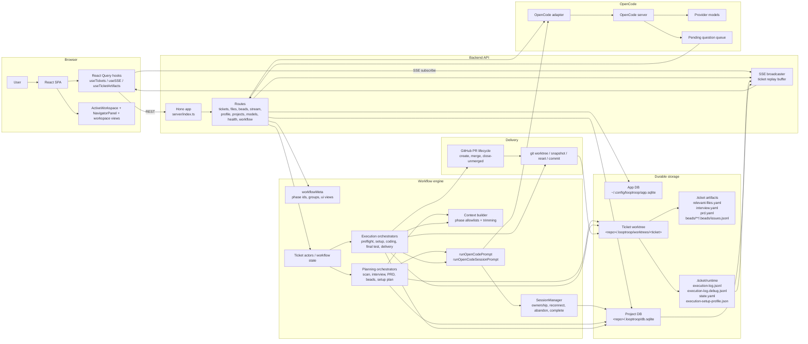

# System Architecture

This document is the canonical architecture reference for the current LoopTroop application.

LoopTroop is not a thin chat wrapper around a coding model. It is a long-running workflow system with explicit planning phases, durable storage, isolated execution worktrees, and resumable OpenCode session ownership. The core architectural choice is simple: important state must live outside the model.

## Mental Model

LoopTroop operates as a layered system:

1. The React SPA renders the live ticket workspace and review tools.
2. The Hono API exposes ticket, project, artifact, and streaming endpoints.
3. Workflow actors and phase orchestrators drive tickets through planning, approval, execution, and delivery.
4. OpenCode sessions do the model work, but only against tightly assembled context.
5. SQLite, JSONL logs, and `.ticket/**` artifacts hold the durable truth.
6. Git worktrees and GitHub delivery convert the plan into an isolated change set and then a PR outcome.

## Runtime Actors

| Actor | Responsibility | Primary modules |
| --- | --- | --- |
| React SPA | Ticket dashboard, workspace views, navigator, approvals, live logs | `src/App.tsx`, `src/components/ticket/*`, `src/components/workspace/*` |
| React Query hooks | Fetching, cache invalidation, optimistic updates, SSE integration | `src/hooks/*` |
| Hono API | REST routes and SSE endpoint under `/api` | `server/index.ts`, `server/routes/*` |
| Workflow metadata | Canonical phase list, UI view mapping, grouping, review metadata | `shared/workflowMeta.ts` |
| Phase orchestrators | Planning, approval, execution, PR delivery, retry and recovery logic | `server/workflow/*`, `server/phases/*` |
| OpenCode adapter | Session creation, prompting, event streaming, questions, health | `server/opencode/adapter.ts` |
| Session manager | Ownership tracking, reconnect validation, completion and abandonment | `server/opencode/sessionManager.ts` |
| SSE broadcaster | Ticket-scoped event fan-out plus replay buffer for reconnect | `server/sse/broadcaster.ts` |
| App database | Singleton profile and attached-project registry | `server/db/index.ts` |
| Project database | Tickets, artifacts, sessions, attempts, history, error occurrences | `server/db/project.ts` |
| Ticket filesystem | Human-readable and execution-time artifacts inside the ticket worktree | `server/storage/*`, `server/phases/*` |
| Git and GitHub layer | Worktrees, diffs, commits, PR creation, merge/close flows | `server/phases/execution/gitOps.ts`, `server/git/*`, `server/github/*` |

## Authoritative Data Ownership

LoopTroop deliberately splits state across several storage layers. Each layer owns a different class of truth.

| Storage location | Canonical contents | Notes |
| --- | --- | --- |
| `~/.config/looptroop/app.sqlite` by default | Singleton profile, attached projects, app meta | Configurable via `LOOPTROOP_CONFIG_DIR` or `LOOPTROOP_APP_DB_PATH` |
| `<project>/.looptroop/db.sqlite` | Projects, tickets, phase artifacts, phase attempts, OpenCode sessions, status history, error occurrences | This is the project-local operational database |
| `<project>/.looptroop/worktrees/<ticket>/` | The isolated ticket worktree used for planning artifacts and code changes | Each ticket gets its own worktree |
| `.ticket/relevant-files.yaml` | Relevant file scan output used by later planning phases | Replaces older `codebase-map.yaml` terminology |
| `.ticket/interview.yaml` and `.ticket/prd.yaml` | Editable review artifacts for the approved planning stages | These are user-facing canonical documents |
| `.ticket/beads/<flow>/.beads/issues.jsonl` | The current bead plan for a given flow or base branch | Stored as line-oriented JSONL, but rewritten atomically on updates |
| `.ticket/runtime/execution-log.jsonl` | Durable normal execution and phase log stream | Read by `/api/files/:ticketId/logs` and folded for UI display |
| `.ticket/runtime/execution-log.debug.jsonl` | Persisted debug/forensic execution log stream | Read by `/api/files/:ticketId/logs?channel=debug`; supports the same log filters |
| `.ticket/runtime/state.yaml` | Runtime state projection for the active execution | Used for restart and status projection |
| `.ticket/runtime/execution-setup-profile.json` | Concrete execution environment profile | Separate from the reviewable setup plan artifact |
| `phase_artifacts` table | Structured snapshots used by the API and UI | Holds artifact content, phase, attempt number, timestamps |

> Note
> SQLite and the filesystem are complementary, not redundant. The database is optimized for querying and workflow bookkeeping; `.ticket/**` keeps artifacts inspectable, editable, and recoverable.

## End-to-End Ticket Lifecycle

1. A ticket starts in `DRAFT` with editable title, description, and priority.
2. `SCANNING_RELEVANT_FILES` creates `relevant-files.yaml` from the ticket description and repo context.
3. The interview council drafts, votes, refines the interview artifact, and iterates until interview coverage is good enough.
4. The user approves the interview artifact.
5. The PRD council drafts, votes, refines, and coverage-checks the spec.
6. The user approves the PRD artifact.
7. The beads council drafts, votes, refines, expands, and coverage-checks the execution plan.
8. The user approves the beads artifact and then reviews the pre-implementation execution setup plan.
9. Implementation runs bead by bead in an isolated ticket worktree, with bounded retry per bead.
10. Post-implementation final testing, integration, PR creation, review follow-up, and cleanup drive the ticket to `COMPLETED`, `CANCELED`, or `BLOCKED_ERROR`.

The full phase map lives in [State Machine](state-machine.md).

## Planning Flow

Planning is intentionally artifact-driven.

| Stage | Primary input | Primary output | Why it exists |
| --- | --- | --- | --- |
| Discovery scan | Ticket details | `relevant-files.yaml` | Grounds planning in the actual codebase |
| Interview council | Ticket details, relevant files | Interview document and answer session | Forces ambiguity out before specs |
| PRD council | Ticket details, interview, relevant files, member-specific Full Answers | PRD document | Produces the feature contract |
| Beads council | Ticket details, PRD, relevant files | Execution bead plan | Converts the spec into execution units |
| Execution setup planning | Ticket details, PRD, beads, execution profile | Reviewable setup plan | Makes the coding environment explicit before code changes begin |

The planning phases are not one long conversation. Each stage assembles a new context window from durable artifacts and runs in its own session scope.

## Execution Flow

Execution is built around beads, not around one monolithic coding prompt.

1. `PRE_FLIGHT_CHECK` verifies the ticket can enter pre-implementation setup.
2. `WAITING_EXECUTION_SETUP_APPROVAL` pauses for setup-plan review before setup commands run.
3. `PREPARING_EXECUTION_ENV` creates the temporary execution environment described by the approved setup plan.
4. `CODING` selects the next runnable bead from the scheduler.
5. `executeBead()` starts or reattaches to the owned OpenCode session for that bead attempt.
6. The model must emit the expected structured bead status markers. Missing or malformed markers trigger a structured retry path.
7. If the attempt stalls or fails, LoopTroop generates a context wipe note, resets the worktree to the bead start commit, and retries in fresh context.
8. When the bead succeeds, LoopTroop captures a diff artifact and advances scheduler state.
9. `RUNNING_FINAL_TEST`, `INTEGRATING_CHANGES`, and `CREATING_PULL_REQUEST` package the result for post-implementation delivery.

See [Execution Loop](execution-loop.md) and [Beads](beads.md).

## Recovery Flow

Recovery is a first-class architectural concern.

| Failure type | Recovery strategy |
| --- | --- |
| Browser reload, close, or reconnect gap | REST state remains canonical; SSE reconnect includes the last event id, replays buffered live events including the latest streaming upsert per log entry, and then refetches tickets, artifacts, bead state, interview state, and server logs |
| Frontend crash or tab close | Interview and approval drafts are persisted as ticket UI-state artifacts, with unload-time keepalive flushing for the latest unsaved snapshot |
| Invalid model output | Retry with repair or explicit re-prompt, depending on phase |
| Bead execution stall | Generate context wipe note, reset worktree, retry in fresh session |
| OpenCode reconnect gap | Validate owned session against remote sessions and recreate if needed |
| Backend process restart | Validate or reconstruct serialized actor snapshots, start actors from durable ticket state, and immediately process restored active snapshots |
| User edits approved planning artifact | Before `PRE_FLIGHT_CHECK`, archive the current approved planning version and downstream phase attempts, cancel active downstream sessions intentionally, save and approve the edit as the new active version, clear stale downstream artifacts/UI state, and restart from the next drafting phase |
| Terminal blockage | Enter `BLOCKED_ERROR` with persisted error occurrence history |

LoopTroop tries hard to preserve the work product while discarding the bad conversational state that produced the failure.

Planning edit restarts are intentionally cancellation-based. Editing an approved interview from later PRD or beads planning cancels active downstream planning sessions as intentional cancellation, archives the current approved interview version plus downstream PRD/beads phase attempts, removes stale PRD/beads artifacts and approval UI state, saves and approves the edited interview as the new active version, and starts `DRAFTING_PRD`. Editing an approved PRD from beads planning applies the same rule to the current approved PRD version and downstream beads attempts, then starts `DRAFTING_BEADS`. Archived approved versions are read-only planning generations backed by phase attempts. These routes stop at the planning boundary: at `PRE_FLIGHT_CHECK` or later, interview and PRD edit saves return `409` instead of modifying execution readiness. Existing tickets and projects, including `PCKM-22`, are not migrated or repaired by this behavior.

If a resume point cannot be proven, recovery stops at `BLOCKED_ERROR` instead of continuing execution against unknown state. `BLOCKED_ERROR` retry requires a preserved `previousStatus`; `CODING` retry also requires a successful reset to the failed bead's `beadStartCommit`.

## Restart And Session Ownership

LoopTroop tracks session ownership in the project database so it can decide whether a remote OpenCode session still belongs to the exact workflow slot that wants to use it.

Ownership keys can include:

- `ticketId`
- `phase`
- `phaseAttempt`
- `memberId`
- `beadId`
- `iteration`
- `step`

This lets LoopTroop safely reconnect in cases like:

- server restart while a ticket is still in the same phase
- phase retry that should resume the currently owned session
- multi-model council phases where each member has its own session identity
- bead execution where iteration and bead identity both matter

It deliberately does not mean "resume any random prior stream." Reconnect only succeeds if the ticket is still in the same phase and the owned active session still exists remotely.

Prompt acquisition is bounded by timeout and abort signals. OpenCode `create`, `list`, and message-read calls are guarded so an OpenCode restart cannot indefinitely block the workflow runner.

## Module Map

### Frontend

| Area | Modules |
| --- | --- |
| App shell and routing | `src/App.tsx` |
| Ticket workspace | `src/components/ticket/ActiveWorkspace.tsx`, `NavigatorPanel.tsx` |
| Workspace views | `src/components/workspace/*` |
| Data hooks | `src/hooks/useTickets.ts`, `useTicketArtifacts.ts`, `useWorkflowMeta.ts`, `useSSE.ts` |

### API Surface

| Area | Modules |
| --- | --- |
| App entry and route mounting | `server/index.ts` |
| Ticket routes | `server/routes/tickets.ts`, `server/routes/ticketHandlers.ts` |
| Files, beads, streaming | `server/routes/files.ts`, `beads.ts`, `stream.ts` |
| Profile, projects, health, models, workflow meta | `server/routes/profiles.ts`, `projects.ts`, `health.ts`, `models.ts`, `workflow.ts` |

### Workflow Engine

| Area | Modules |
| --- | --- |
| Workflow runner and phase transitions | `server/workflow/*` |
| Planning phases | `server/workflow/phases/*`, `server/phases/interview/*`, `server/phases/prd/*`, `server/phases/beads/*` |
| Execution phases | `server/phases/preflight/*`, `server/phases/execution/*`, `server/phases/executionSetup/*`, `server/phases/executionSetupPlan/*`, `server/phases/finalTest/*`, `server/phases/integration/*`, `server/phases/cleanup/*`, `server/phases/verification/*` |

### Persistence

| Area | Modules |
| --- | --- |
| App DB bootstrap | `server/db/index.ts` |
| Project DB bootstrap | `server/db/project.ts` |
| Schema | `server/db/schema.ts` |
| Ticket and project storage helpers | `server/storage/*` |

### OpenCode Integration

| Area | Modules |
| --- | --- |
| Adapter and factory | `server/opencode/adapter.ts`, `factory.ts` |
| Context assembly | `server/opencode/contextBuilder.ts` |
| Session ownership and reconnect | `server/opencode/sessionManager.ts` |
| Prompt runner | `server/workflow/runOpenCodePrompt.ts` |

## ASCII Overview

```text
User
  |
  v
React SPA
  |  REST (/api/*)                    SSE (/api/stream)
  |-------------------------------> Hono API <------------------+
  |                                                            |
  |                                                            v
  |                                                     SSE broadcaster
  |                                                            |
  v                                                            |
Workspace views <----------------------------------------------+
  |
  v
Workflow actors and phase orchestrators
  |            |                 |                 |
  |            |                 |                 |
  v            v                 v                 v
App DB     Project DB      Ticket worktree    OpenCode adapter/session manager
                               |                        |
                               v                        v
                         .ticket artifacts         OpenCode server
                         runtime JSONL/logs             |
                               |                        v
                               +-------------------- Provider models
  |
  v
git worktree, commits, PR creation, merge/close
```

## Detailed Mermaid Diagram



## Related Docs

- [Core Philosophy](core-philosophy.md)
- [Context Isolation](context-isolation.md)
- [LLM Council](llm-council.md)
- [Execution Loop](execution-loop.md)
- [Beads](beads.md)
- [OpenCode Integration](opencode-integration.md)
- [Database Schema](database-schema.md)
- [API Reference](api-reference.md)
