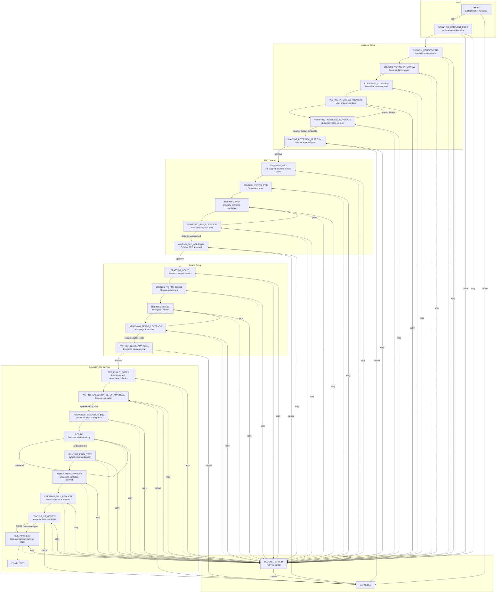

# Ticket Flow

LoopTroop does not move a ticket through a tiny backlog -> coding -> done list. It runs a staged lifecycle with planning loops, approval gates, execution setup, bead-scoped coding, PR delivery, and explicit error recovery.

The current truth for this page comes from:

- `shared/workflowMeta.ts`
- `server/machines/ticketMachine.ts`
- `server/routes/ticketHandlers.ts`

## At A Glance

```text
DRAFT
  -> SCANNING_RELEVANT_FILES
  -> Interview loop
  -> PRD loop
  -> Beads loop
  -> PRE_FLIGHT_CHECK
  -> WAITING_EXECUTION_SETUP_APPROVAL
  -> PREPARING_EXECUTION_ENV
  -> CODING bead loop
  -> RUNNING_FINAL_TEST
  -> INTEGRATING_CHANGES
  -> CREATING_PULL_REQUEST
  -> WAITING_PR_REVIEW
  -> CLEANING_ENV
  -> COMPLETED

Any active phase can fail into BLOCKED_ERROR.
BLOCKED_ERROR -> RETRY -> previousStatus
Any cancellable phase -> CANCELED
WAITING_PR_REVIEW -> merge or close-unmerged -> CLEANING_ENV
```

Browser, frontend, backend, OpenCode, and model interruptions do not create new workflow states. They are recovered through persisted ticket state, SSE replay/refetch, OpenCode ownership checks, and phase-specific retry rules. If the app cannot prove a safe resume point, it blocks the ticket instead of guessing.

## Detailed Flow Diagram



## User Actions By Status

`getAvailableWorkflowActions()` exposes the current explicit user actions:

| Status set | Available actions | Notes |
| --- | --- | --- |
| `DRAFT` | `start`, `cancel` | `start` locks model configuration and initializes the ticket workspace. |
| `WAITING_INTERVIEW_APPROVAL`, `WAITING_PRD_APPROVAL`, `WAITING_BEADS_APPROVAL`, `WAITING_EXECUTION_SETUP_APPROVAL` | `approve`, `cancel` | The generic approve route dispatches to the phase-specific approval handler. |
| `WAITING_PR_REVIEW` | `merge`, `close_unmerged`, `cancel` | `merge` is also exposed through `/verify` as an alias during the transition period. |
| `BLOCKED_ERROR` | `retry`, `cancel` | `retry` re-enters the exact `previousStatus` preserved in machine context. |
| Most active phases | `cancel` | Active work can be stopped from planning, execution, or review phases. |
| `COMPLETED`, `CANCELED` | none | These are terminal states. |

Two extra guards matter at the user-action layer:

- `WAITING_BEADS_APPROVAL`, `WAITING_EXECUTION_SETUP_APPROVAL`, and execution-band retries check for project-level execution-band conflicts before they advance.
- `BLOCKED_ERROR` retry from `CODING` first tries to restore the failed bead into a retryable state before it re-enters `CODING`.
- `BLOCKED_ERROR` retry is rejected when no preserved `previousStatus` exists. The app no longer falls back to `DRAFT`, because that can hide an unsafe partial run.
- `CODING` retry is rejected when the failed bead cannot be reset to a recorded bead-start commit.

## Artifact Checkpoints

| Point in the flow | Main durable artifacts |
| --- | --- |
| Start of planning | ticket row, locked model configuration, ticket worktree |
| Workflow state | durable ticket status plus serialized XState snapshot |
| Relevant file scan | `.ticket/relevant-files.yaml` plus scan companion artifacts |
| Interview compile and answers | `.ticket/interview.yaml`, interview session snapshot, answer state |
| PRD drafting and approval | `.ticket/prd.yaml`, full answers artifact, PRD coverage history |
| Beads coverage and approval | `.ticket/beads/<flow>/.beads/issues.jsonl`, beads coverage history, approval receipt |
| Setup-plan approval | `execution_setup_plan` artifact and approval receipt |
| Execution runtime | `.ticket/runtime/execution-log.jsonl`, `.ticket/runtime/state.yaml`, execution setup profile, bead notes and diffs |
| Frontend resume | ticket UI-state artifacts for approval drafts and interview drafts, plus SSE last-event id in browser storage |
| Final delivery | final test report, integration report, pull request report, merge report, cleanup report |

## Status Groups

The UI and API both group workflow states:

| Group | Meaning |
| --- | --- |
| `todo` | Draft-only backlog state before AI work starts |
| `interview` | Intake, questioning, and interview approval |
| `prd` | Specification drafting, refinement, coverage, approval |
| `beads` | Execution-plan drafting, refinement, expansion, approval |
| `execution` | Pre-flight, setup, coding, final verification, PR delivery, error recovery |
| `done` | Successful completion or cancellation |

## Status-By-Status Detail

### Entry

| Status | What happens here | Main outputs | User action | Normal exits |
| --- | --- | --- | --- | --- |
| `DRAFT` | The ticket is a backlog item only. Title, description, priority, and project assignment are still user-editable. No AI work, planning artifacts, or runtime worktree activity has started yet. | Ticket record only. | `start`, `cancel` | `start` initializes the workspace and enters scan; `cancel` goes straight to `CANCELED`. |

### Interview

| Status | What happens here | Main outputs | User action | Normal exits |
| --- | --- | --- | --- | --- |
| `SCANNING_RELEVANT_FILES` | The locked main implementer scans the repo context from ticket details and identifies likely files, interfaces, and related logic. This is single-model groundwork before any council phase starts. | `relevant-files.yaml`, scan artifact, scan logs. | `cancel` | Success advances to interview drafting; failures block. |
| `COUNCIL_DELIBERATING` | Council members independently draft competing interview strategies and question sets from the same ticket + relevant-file context. Quorum matters here. | Interview draft artifacts and per-model logs. | `cancel` | Enough valid drafts moves to interview voting. |
| `COUNCIL_VOTING_INTERVIEW` | The council scores anonymized interview drafts with a structured rubric and picks one winner for normalization. | Vote artifacts, score breakdowns, winner selection. | `cancel` | Winner advances to interview compilation. |
| `COMPILING_INTERVIEW` | The winning draft is normalized into the interactive interview that the UI can render and track across batches and follow-up rounds. | Canonical interview artifact and interview session snapshot. | `cancel` | Success advances to `WAITING_INTERVIEW_ANSWERS`. |
| `WAITING_INTERVIEW_ANSWERS` | The automated pipeline pauses while you answer or skip the active question batch. This state can repeat when coverage asks for follow-up questions. | Answer state, updated interview artifact, per-round history. | submit answers, skip, skip all, `cancel` | Submission moves to coverage; skip-all jumps directly to approval with a synthetic clean coverage receipt. |
| `VERIFYING_INTERVIEW_COVERAGE` | The interview winner checks whether the current answers are sufficient. If not, it creates targeted follow-up questions until the configured budget is exhausted. | Coverage artifact, gap descriptions, follow-up batch when needed. | `cancel` | Gaps loop back to answers; clean or budget exhaustion advances to approval. |
| `WAITING_INTERVIEW_APPROVAL` | You review the finalized interview in structured or raw form, edit it if needed, and explicitly approve the interview as the source material for PRD generation. | Approved interview artifact and approval receipt. | `approve`, `cancel` | Approval advances to PRD drafting. |

#### Max Interview Questions

This setting caps how many initial clarifying questions the compiled interview can contain before the UI pauses for human answers. Lower values keep intake shorter; higher values let the planning flow gather more context up front.

#### Coverage Follow-Up Budget

This setting limits how much of the interview budget can be spent on follow-up coverage questions after the first answer round. It exists to keep interview coverage from turning into an open-ended clarification loop.

#### Interview Coverage Passes

This setting caps how many times `VERIFYING_INTERVIEW_COVERAGE` may generate follow-up work before LoopTroop stops extending the loop and advances with the current coverage state.

### PRD

| Status | What happens here | Main outputs | User action | Normal exits |
| --- | --- | --- | --- | --- |
| `DRAFTING_PRD` | The system first fills skipped interview answers into a shared full-answers artifact, then each council member independently drafts a PRD candidate from the approved interview. | Full answers artifact, PRD drafts, draft diagnostics. | `cancel` | Valid quorum advances to PRD voting. |
| `COUNCIL_VOTING_PRD` | The council scores anonymized PRD drafts against a weighted requirements rubric and selects the best baseline. | PRD vote artifacts, ranking breakdowns, winner selection. | `cancel` | Winner advances to PRD refinement. |
| `REFINING_PRD` | The winning PRD model upgrades its own draft by selectively merging stronger requirements, acceptance criteria, tests, and edge cases from the losing drafts. | Refined PRD Candidate v1 and optional diff metadata. | `cancel` | Success advances to PRD coverage. |
| `VERIFYING_PRD_COVERAGE` | The current PRD candidate is checked against the approved interview and revised in-place when gaps are found. This is a versioned loop capped by configuration. | PRD coverage history, latest PRD candidate, unresolved-gap diagnostics. | `cancel` | Clean or cap-reached advances to PRD approval. |
| `WAITING_PRD_APPROVAL` | You review the current PRD candidate, inspect any unresolved warnings, edit the document if needed, and explicitly lock the spec that beads planning will decompose. | Approved PRD artifact and approval receipt. | `approve`, `cancel` | Approval advances to beads drafting. |

#### PRD Coverage Passes

This setting caps how many revision cycles `VERIFYING_PRD_COVERAGE` may run while reconciling the PRD against the approved interview. The goal is to improve completeness without letting PRD coverage revise forever.

### Beads

| Status | What happens here | Main outputs | User action | Normal exits |
| --- | --- | --- | --- | --- |
| `DRAFTING_BEADS` | Council members independently decompose the approved PRD into semantic execution blueprints with dependencies, acceptance criteria, and test intent. | Beads draft artifacts and structure metrics. | `cancel` | Valid quorum advances to beads voting. |
| `COUNCIL_VOTING_BEADS` | The council ranks anonymized blueprints using an architecture rubric focused on decomposition quality, feasibility, dependency correctness, and testability. | Beads vote artifacts, scorecards, winner selection. | `cancel` | Winner advances to beads refinement. |
| `REFINING_BEADS` | The winning blueprint is strengthened with better tasks, constraints, and test ideas from losing blueprints, while preserving the dependency graph shape. | Refined semantic blueprint plus diff metadata. | `cancel` | Success advances to beads coverage. |
| `VERIFYING_BEADS_COVERAGE` | The semantic blueprint is checked against the PRD, revised until acceptable, then expanded into execution-ready beads with file targets, commands, and runtime fields. | Coverage history, expanded `issues.jsonl`, approval candidate. | `cancel` | Expanded plan advances to beads approval. |
| `WAITING_BEADS_APPROVAL` | You review the execution-ready bead plan before any coding begins. This is the last planning approval gate and the last easy point to reshape execution ordering. | Approved beads artifact and approval receipt. | `approve`, `cancel` | Approval advances to pre-flight checks. |

#### Beads Coverage Passes

This setting caps how many coverage and expansion revisions LoopTroop may run while turning the semantic blueprint into execution-ready beads. It keeps decomposition quality work bounded before execution starts.

### Execution And Delivery

| Status | What happens here | Main outputs | User action | Normal exits |
| --- | --- | --- | --- | --- |
| `PRE_FLIGHT_CHECK` | LoopTroop runs deterministic readiness checks: workspace health, OpenCode reachability, execution-mode probe, bead availability, and dependency-graph sanity. | Pre-flight report. | `cancel` | Passing checks move to setup-plan approval. |
| `WAITING_EXECUTION_SETUP_APPROVAL` | LoopTroop audits the workspace, drafts only the temporary setup still needed, and pauses for you to review or regenerate the setup plan before any setup commands run. | `execution_setup_plan`, generation report, approval receipt on approval. | `approve`, `cancel` | Approved plan advances to execution setup. |
| `PREPARING_EXECUTION_ENV` | The approved setup plan is executed in a constrained way. The goal is a reusable runtime profile, not general project mutation. | Execution setup profile, setup logs, setup diagnostics. | `cancel` | Success enters `CODING`. |
| `CODING` | The coding agent executes one bead at a time. Each bead gets narrow context, owned sessions, structured completion markers, bead diffs, and bounded fresh-session retries. | Bead status updates, bead notes, per-bead commits, diff artifacts, execution log stream. | `cancel` | Each successful bead self-transitions back to `CODING`; when all beads are done the flow moves to final test. |
| `RUNNING_FINAL_TEST` | The main implementer verifies the whole ticket result holistically, beyond individual bead success. | Final test artifact, test results, retry diagnostics if needed. | `cancel` | Passing tests advance to integration. |
| `INTEGRATING_CHANGES` | The ticket branch is squashed into a single clean candidate commit for human review, while preserving the bead-level history in audit artifacts. | Integration report and candidate commit metadata. | `cancel` | Success advances to PR creation. |
| `CREATING_PULL_REQUEST` | The candidate branch is pushed and a draft PR is created or updated on GitHub using the ticket intent, diff, and verification results. | Pull request report with URL, number, head SHA, generated title/body. | `cancel` | Success advances to PR review waiting state. |
| `WAITING_PR_REVIEW` | Automation stops while you review the draft PR and decide whether to merge it or finish without merging. External merges can also be detected and synchronized from here. | Stable review gate, merge report after decision. | `merge`, `close_unmerged`, `cancel` | Merge or close-unmerged both advance to cleanup. |
| `CLEANING_ENV` | LoopTroop removes transient runtime state but preserves planning artifacts, execution logs, reports, and audit history. | Cleanup report and preserved history. | `cancel` | Successful cleanup moves to `COMPLETED`. |

### Recovery And Terminal States

| Status | What happens here | Main outputs | User action | Normal exits |
| --- | --- | --- | --- | --- |
| `BLOCKED_ERROR` | A blocking failure has paused the workflow. The error is tied to a preserved `previousStatus`, so retry can re-enter the exact failed phase rather than guessing where to resume. | Error occurrence history, failure diagnostics, preserved `previousStatus`. | `retry`, `cancel` | `retry` re-enters the preserved prior state; `cancel` moves to `CANCELED`. |
| `COMPLETED` | The ticket finished successfully. The workflow is now read-only from an automation perspective, but all artifacts remain available for inspection. | Full lifecycle history remains accessible. | none | Terminal. |
| `CANCELED` | The ticket was stopped by user action before or after partial progress. Earlier artifacts are preserved for review. | Preserved partial history and cancellation metadata. | none | Terminal. |

## Retry And Blocked-Error Semantics

`BLOCKED_ERROR` is not just a generic failure bucket. The machine stores the last active status as `previousStatus`, and `RETRY` branches back to that exact status:

- scan failures retry scan
- planning failures retry the exact planning phase that failed
- approval-state failures retry the same approval state
- execution-band failures retry the exact execution phase
- coding failures retry `CODING`, after the failed bead is restored into a retryable state if possible

This matters because LoopTroop does not treat recovery as “restart the whole ticket.” Recovery is phase-scoped.

The retry route adds two safety checks before it dispatches `RETRY`:

- if `previousStatus` is absent, retry returns a conflict response and the user must cancel or inspect the stored failure
- if the preserved status is `CODING`, LoopTroop resets the failed or interrupted bead to its `beadStartCommit`; if that reset cannot be performed, retry returns a conflict response instead of resuming against a dirty worktree

## Safe Resume By Interruption Type

| Interruption | Expected resume behavior |
| --- | --- |
| Browser closes, reloads, or loses the SSE connection | The next workspace load uses REST state as truth. SSE reconnect sends the last event id when available, then refetches the ticket, artifacts, interview state, bead state, and server logs to cover replay gaps. |
| Frontend crashes or restarts | Draft interview answers and approval editor state are saved to ticket UI-state artifacts. Page unload uses a best-effort keepalive write for the latest unsaved snapshot. |
| Backend process restarts | Startup validates or reconstructs non-terminal actor snapshots, starts actors from their stored state, and immediately processes the restored snapshot so active work continues. |
| OpenCode server restarts or loses a session | Owned sessions are validated against the remote OpenCode session list. Missing remote sessions are abandoned and a fresh owned session is created when the phase can safely continue. |
| Model prompt fails, times out, or returns invalid output | Planning phases use structured retries and attempt-scoped artifacts. Execution phases use bead-scoped retry, context wipe notes, and worktree reset before trying again. |
| Resume point cannot be proven | The ticket enters or remains in `BLOCKED_ERROR` with an explicit retry/cancel choice. |

## PR Review Outcomes

`WAITING_PR_REVIEW` has two intentional successful exits:

- `merge`: merge the draft PR, sync the local base branch, then clean up and mark the ticket complete
- `close_unmerged`: keep the PR and remote branch unmerged, then clean up and still mark the ticket complete

That second path exists because “ticket completed” in LoopTroop means “the workflow reached a deliberate delivery outcome,” not necessarily “the branch was merged.”

## Related Docs

- [State Machine](state-machine.md)
- [Execution Loop](execution-loop.md)
- [Beads](beads.md)
- [System Architecture](system-architecture.md)
